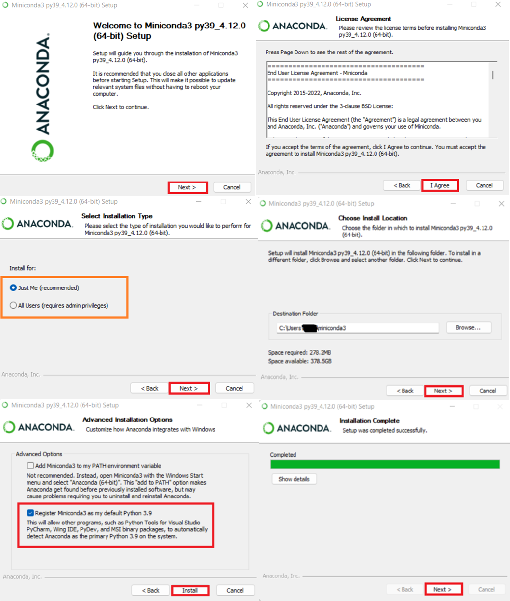
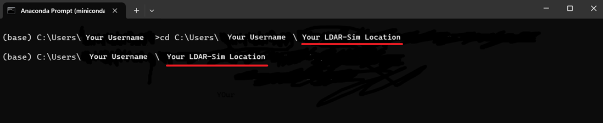
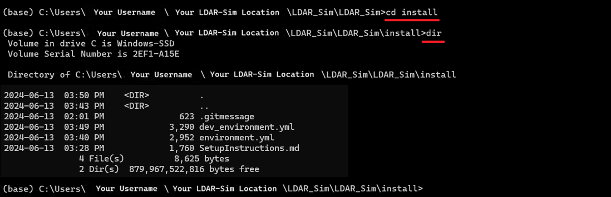
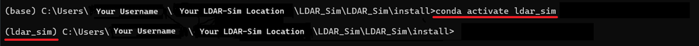
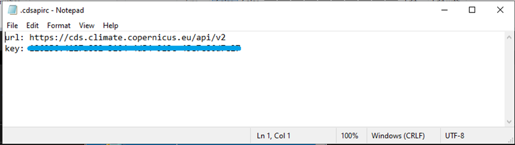

# Installation Guide <!-- omit in toc -->

## Table of Contents

- [Table of Contents](#table-of-contents)
- [1. Introduction](#1-introduction)
- [2. Git](#2-git)
  - [What is Git? Why do you need it?](#what-is-git-why-do-you-need-it)
  - [Installing Git](#installing-git)
  - [Accessing Git](#accessing-git)
- [3. MiniConda3](#3-miniconda3)
  - [What is MiniConda? Why do you need it?](#what-is-miniconda-why-do-you-need-it)
  - [Installing MiniConda3](#installing-miniconda3)
- [4. LDAR-Sim](#4-ldar-sim)
  - [Downloading LDAR-Sim](#downloading-ldar-sim)
  - [Setting up LDAR-Sim environment](#setting-up-ldar-sim-environment)
- [5. Weather File](#5-weather-file)
- [6. Windows Path Modifications (Optional)](#6-windows-path-modifications-optional)
  - [Enabling Long File Paths in Windows (Example is from Windows 11)](#enabling-long-file-paths-in-windows-example-is-from-windows-11)
- [Enabling Long File Paths in Git](#enabling-long-file-paths-in-git)
- [7. IDE / Text Editors](#7-ide--text-editors)
  - [What is an IDE (integrated development environment)?](#what-is-an-ide-integrated-development-environment)
- [8. References](#8-references)

## 1. Introduction

The purpose of this installation guide is to assist individuals in setting up the required and recommended software to run LDAR-Sim. This guide primarily concentrates on installation and setup procedures for a Windows operating system. While it can still be followed for non-Windows operating systems, such as Linux or macOS, it's important to note that there may be differences specific to those operating systems that are not addressed in this guide. To run LDAR-Sim effectively, the following recommendations are provided:

- Git
- GitHub Account (Optional)
- MiniConda3
- Copernicus account (Required to pull Weather files which inform simulated weather)
- Alternate Text Editors/IDE (Optional) = Alternative software like notepad++ for opening files and editing

## 2. Git

### What is Git? Why do you need it?

Git is an open-source software used for version control, often utilized by programmers to collaborate and share source code during software development. This step can be bypassed if users opt to directly download the ZIP from GitHub. However, keeping code up to date with the newest versions and updates must be done manually for each file and cannot be semi-automated by Git’s control system.

### Installing Git

To install Git, visit the website (<https://git-scm.com/>).
Navigate to the downloads tab and select the appropriate operating system for your system.

Choose the correct installer corresponding to your system. To determine this, search "About your PC" in your computer's search bar.

After the download completes, open the installer and proceed by following the provided instructions.

### Accessing Git

For Windows 11, to access the Git terminal window at a specific location, right-click within File Explorer that's opened to the desired location and select "Show more options." This will display additional options.

Select "Git Bash Here." This action will open the Git Bash terminal.

Further steps for utilizing this window will be explained subsequently.

## 3. MiniConda3

### What is MiniConda? Why do you need it?

MiniConda is a software designed to manage various packages (code libraries) for Python. It aids in maintaining and tracking the Python packages necessary for LDAR-Sim.

Users are encouraged to select and employ the Python package managers they are most familiar with, as there are multiple alternatives available, including Pipenv, Docker, etc. Nevertheless, this guide will specifically concentrate on the utilization of MiniConda.

### Installing MiniConda3

Visit the MiniConda download website (<https://docs.conda.io/en/latest/miniconda.html>) and download the appropriate installer for your system.

Execute the installer executable and proceed with the installation of MiniConda.



## 4. LDAR-Sim

### Downloading LDAR-Sim

To download LDAR-Sim from GitHub, there are two available options:

1. Download using Git
2. Directly downloading the ZIP.

For the first option, where Git is required, users must have Git installed on their system.

The command "git clone" can be used to clone and download the repository via the Git Bash window to where the Git Bash window is currently active:

```cmd
git clone https://github.com/LDAR-Sim/LDAR_Sim.git
```

### Setting up LDAR-Sim environment

Once a local copy of LDAR-Sim has been downloaded, set up the Python environments needed to run LDAR-Sim by following the steps listed below.

First, obtain/copy the file location where the local LDAR-Sim files are located. This can be done by right-clicking the address bar of the file explorer window and selecting "Copy address as text".

Next, open a MiniConda (Anaconda) console window using the start menu.

Now, using the command cd, navigate to the location where LDAR-Sim was placed (the location obtained previously with "Copy address as text") in the Anaconda Prompt.

Example Windows command:

```cmd
cd C:\Users\[user]\Desktop\LDAR_Sim
```

An example of the command the resulting screen:


The LDAR-Sim folder provides access to LDAR-Sim documentation, including the User Manual, Read Me, and Change Log files. To set up LDAR-Sim, access to the contents of the install folder is necessary.

Therefore, change directories (folders) once more to be within the Install folder with the command `cd`.

```cmd
cd install
```

**Note**:In Windows, you can use the command dir to list the files and folders you have access to.

Executing the command dir should display the following files: *.gitmessage, environment.yml, dev_environment.yml,* and *SetupInstructions.md*.



From this point, the following commands will be executed to set up the LDAR Sim virtual environment:

```cmd
conda config --add channels conda-forge
conda config --set channel_priority strict
conda env create -f environment.yml
```

Enter them sequentially in the Anaconda Prompt window, allowing the process to complete before entering the next command. The final of these three commands, Conda create, may take some time to run before prompting for confirmation to download and install a list of packages. Confirm with Y.

**Note**: Please be aware that the `environment.yml` file exclusively contains the essential dependencies required to run LDAR-Sim as a regular user. If you are in a development role, refer to `dev_environment.yml` for additional requirements specific to the development environment.

Once the download and installation is complete, activate the new environment with the following command.

```cmd
conda activate ldar_sim_env
```

**Note**: `Activate ldar-sim_env` refers to activating the ldar-sim "environment" – a pre-defined group of the required Python code libraries. This command must be run each time a new Anaconda Prompt is opened to run LDAR-Sim (it will always be the first command to be run).



## 5. Weather File

The weather files used within LDAR-Sim are sourced from an online database. Accessing this database requires creating an account with Copernicus (<https://cds.climate.copernicus.eu/cdsapp#!/home>). The following steps will allow users to utilize the weather downloader located within the LDAR-Sim/src/weather folder.

Once signed up and logged in, navigate to the "api-how-to" tab (<https://cds.climate.copernicus.eu/api-how-to>) If logged in, a URL and a key will be available for copying.

Copy the entire text box and then open a file explorer window.

Type `%USERPROFILE%` in the search bar of the file explorer and execute the search.

Create a new `.txt` file in this location (right-click, new, text document) and rename the file to `.cdsapirc`.

**Note:** Users must have file name extensions shown to change the file type to `.cdsapirc`.

Open this file using Notepad (right-click the file, select “Open with”, then choose Notepad).

Inside this file, paste the copied URL and Key from the website and save.



## 6. Windows Path Modifications (Optional)

If running LDAR-Sim on the Windows operating system, you may encounter errors related file path length. The simulator is design to provide warnings when file paths begin to become to long. To resolve this problem, users may enable windows long file paths or move LDAR-Sim closer to the C drive in folder organization. To use Git with longer filepaths, the long file paths must also be added to the git settings.

**Note of Caution**: Enabling Windows Long Paths may cause issues with older third party software on windows that is incompatible with Long Paths.

### Enabling Long File Paths in Windows (Example is from Windows 11)

1. Open the windows run dialog with Windows Key + R at the same time
   

2. Type gpedit.msc into the run dialog and hit ok. You will see the group policy editor open up
   
3. Navigate to **Local Computer Policy** > **Computer Configuration** > **Administrative Templates** > **System** > **Filesystem**
   
4. Double Click on "Enable Win32 long paths
   
5. Select Enable, click Apply and then OK and restart the computer
   

## Enabling Long File Paths in Git

1. Run command prompt as administrator:
2. Type in the following command:

  ```cmd
  git config --global core.longpaths true
  ```

## 7. IDE / Text Editors

### What is an IDE (integrated development environment)?

“An integrated development environment is a software application that provides comprehensive facilities to computer programmers for software development” – Wikipedia

For many individuals, it serves as an alternative to a text editor, offering additional features such as color coding and file formatting aid. The examples covered here include VS Code and Notepad++.
While some LDAR-Sim users prefer to carry out the parameterization workflow in an IDE, it is not required.

Visual Studio is a powerful IDE available for download from <https://code.visualstudio.com/>.

Notepad++ is an alternative text editor that provides the ability to open multiple tabs/files and offers color coding. It can be downloaded from <https://notepad-plus-plus.org/downloads/>.
To download, choose the most recent version and download the installer.

## 8. References

<https://git-scm.com/>

<https://git-scm.com/docs>

<https://docs.conda.io/en/latest/miniconda.html>

<https://cds.climate.copernicus.eu/cdsapp#!/home>

<https://notepad-plus-plus.org/downloads/>

<https://code.visualstudio.com/>
