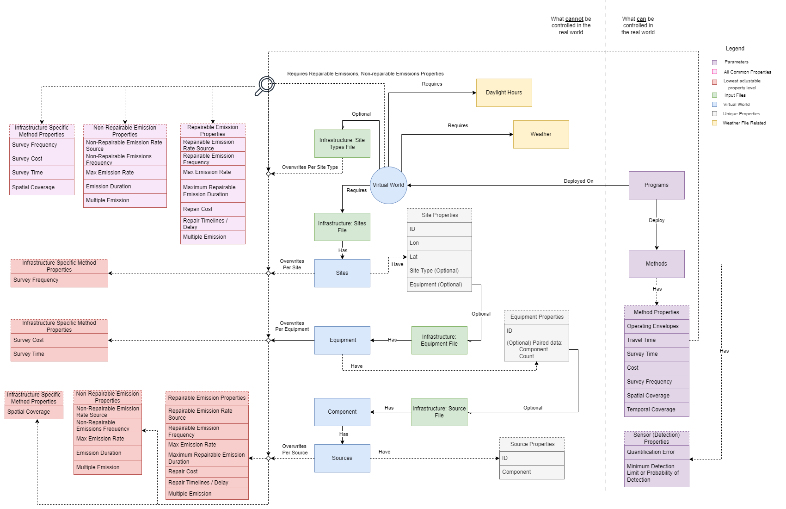

# LDAR-Sim Documentation for Input Parameters and Data

Github Repository: LDAR-Sim

Version: 4.0

Branch: Master

Document Custodian: Sally Jang

Email: <sally@highwoodemissions.com>

--------------------------------------------------------------------------------

## Table of Contents

- [LDAR-Sim Documentation for Input Parameters and Data](#ldar-sim-documentation-for-input-parameters-and-data)
  - [Table of Contents](#table-of-contents)
  - [1. Read this first](#1-read-this-first)
    - [Notes for Developers](#notes-for-developers)
  - [2. Introduction](#2-introduction)
  - [3. File Structure](#3-file-structure)
  - [4. Introducing Parameter Files](#4-introducing-parameter-files)
    - [Parameter file usage](#parameter-file-usage)
    - [Parameter Hierarchy](#parameter-hierarchy)
    - [Versioning of Parameter Files](#versioning-of-parameter-files)
    - [Parameter File Formats](#parameter-file-formats)
  - [5. Simulation Settings](#5-simulation-settings)
    - [\<parameter\_level\> (simulation\_settings)](#parameter_level-simulation_settings)
    - [\<version\> (simulation\_settings)](#version-simulation_settings)
    - [\<input\_directory\>](#input_directory)
    - [\<output\_directory\>](#output_directory)
    - [\<baseline\_program\>](#baseline_program)
    - [\<reference\_program\> WIP](#reference_program-wip)
    - [\<processes\_count\>](#processes_count)
    - [\<simulation\_count\>](#simulation_count)
    - [\<preseed\_random\>](#preseed_random)
  - [6. Output Settings](#6-output-settings)
    - [\<parameter\_level\> (outputs)](#parameter_level-outputs)
    - [\<version\> (outputs)](#version-outputs)
  - [7. Virtual World Setting](#7-virtual-world-setting)
    - [\<parameter\_level\> (virtual\_world)](#parameter_level-virtual_world)
    - [\<version\> (virtual world)](#version-virtual-world)
    - [\<start\_date\>](#start_date)
    - [\<end\_date\>](#end_date)
    - [\<infrastructure\>](#infrastructure)
      - [\<sites\_file\>](#sites_file)
      - [\<site\_type\_file\>](#site_type_file)
      - [\<equipment\_group\_file\>](#equipment_group_file)
      - [\<sources\_file\>](#sources_file)
    - [\<site\_samples\>](#site_samples)
    - [\<consider\_weather\>](#consider_weather)
    - [\<weather\_file\>](#weather_file)
    - [\<emissions\>](#emissions)
      - [\<emissions\_file\>](#emissions_file)
      - [\<ERS\>](#ers)
      - [\<LPR\>](#lpr)
      - [\<NRd\>](#nrd)
      - [\<multi\>](#multi)
      - [\<NR\_ERS\>](#nr_ers)
      - [\<NR\_EPR\>](#nr_epr)
      - [\<duration\>](#duration)
      - [\<NR\_multi\>](#nr_multi)
    - [\<Repairs\>](#repairs)
    - [\<cost\>](#cost)
      - [\<vals\> (cost)](#vals-cost)
      - [\<file\> (cost)](#file-cost)
    - [\<delay\>](#delay)
      - [\<vals\> (delay)](#vals-delay)
      - [\<file\> (delay)](#file-delay)
  - [8. Program Inputs](#8-program-inputs)
    - [\<parameter\_level\> (programs)](#parameter_level-programs)
    - [\<version\> (programs)](#version-programs)
    - [\<program\_name\>](#program_name)
    - [\<method\_labels\>](#method_labels)
    - [\<economics\>](#economics)
      - [\<carbon\_price\_tonnes\_CO2\_equivalent\> WIP](#carbon_price_tonnes_co2_equivalent-wip)
      - [\<global\_warming\_potential\_CH4\> WIP](#global_warming_potential_ch4-wip)
      - [\<sale\_price\_of\_natural\_gas\> WIP](#sale_price_of_natural_gas-wip)
      - [\<verification\_cost\> WIP](#verification_cost-wip)
    - [\<duration\_estimate\>](#duration_estimate)
      - [\<duration\_factor\> WIP](#duration_factor-wip)
      - [\<duration\_method\>](#duration_method)
  - [9. Method Inputs](#9-method-inputs)
  - [10. Virtual World Defining Files](#10-virtual-world-defining-files)
    - [Sites File](#sites-file)
    - [Site Type File](#site-type-file)
    - [Equipment File](#equipment-file)
    - [Source File](#source-file)
    - [Emissions File](#emissions-file)
  - [11. Legacy Inputs](#11-legacy-inputs)
    - [Simulation Settings Parameters](#simulation-settings-parameters)
      - [\<pregenerate\_leaks\>](#pregenerate_leaks)
      - [\<print\_from\_simulation\>](#print_from_simulation)
      - [\<outputs\>](#outputs)
      - [\<site\_visits\>](#site_visits)
      - [\<leaks\>](#leaks)
      - [\<sites\>](#sites)
      - [\<timeseries\>](#timeseries)
      - [\<plots\>](#plots)
      - [\<batch\_reporting\>](#batch_reporting)
      - [\<make\_plots\>](#make_plots)
    - [Virtual World Settings Parameters](#virtual-world-settings-parameters)
      - [\<consider\_venting\>](#consider_venting)
      - [\<weather\_is\_hourly\>](#weather_is_hourly)
      - [\<infrastructure\_file\>](#infrastructure_file)
      - [\<subtype\_file\>](#subtype_file)
      - [\<leak\_dist\_params\>](#leak_dist_params)
      - [\<leak\_dist\_type\>](#leak_dist_type)
      - [\<leak\_file\>](#leak_file)
      - [\<leak\_file\_use\>](#leak_file_use)
      - [\<max\_leak\_rate\>](#max_leak_rate)
      - [\<units\>](#units)
      - [\<n\_init\_leaks\_prob\>](#n_init_leaks_prob)
      - [\<n\_init\_days\>](#n_init_days)
      - [\<subtype\_leak\_dist\_file\>](#subtype_leak_dist_file)
      - [\<subtype\_times\_file\>](#subtype_times_file)
      - [\<vent\_file\>](#vent_file)
  - [12. Data sources, modelling confidence and model sensitivity](#12-data-sources-modelling-confidence-and-model-sensitivity)
    - [Duty Holder / Operator (historical LDAR data)](#duty-holder--operator-historical-ldar-data)
    - [Duty Holder / Operator (organizational data)](#duty-holder--operator-organizational-data)
    - [Technology / Solution Provider / Operator (if self-performing LDAR)](#technology--solution-provider--operator-if-self-performing-ldar)
    - [Modeling Expert](#modeling-expert)
  - [13. References](#13-references)

--------------------------------------------------------------------------------

## 1\. Read this first

Please note the following before reading, using, or modifying this document:

- The purpose of this document is to introduce LDAR-Sim, provide guidance for use, and catalogue input parameters, files, data, and arguments required to run the LDAR-Sim model.
- The document you are now reading will _always_ be associated with a specific version or branch of LDAR-Sim. Multiple versions of this document therefore exist, as multiple versions and sub-versions of LDAR-Sim exist.
- **If you are submitting a pull request to the public LDAR-Sim repo**, please update this documentation alongside modifications to code. Your pull request will not be approved without updating this document with relevant changes to inputs, how they work, and their implications for outputs.
- For more information on LDAR-Sim, including code, instructions, and additional resources, please visit the Github page by [clicking this link](https://github.com/LDAR-Sim/LDAR_Sim).
- If you find any errors or inaccuracies in this documentation or in LDAR-Sim, please contact the document custodian (email included above) or leave a ticket in the Git Issues [link](https://github.com/LDAR-Sim/LDAR_Sim/issues).
- The parameter descriptions in this document are provided in an order matching that of parameters in the default parameter files. When updating this document to add new parameters descriptions, ensure the ordering is correct.
- _**Useful tip for searching the document:**_ If searching for the entry describing as specific parameter as opposed to to searching for mentions of that parameter, search for <parameter_name> to uniquely match the entry describing the parameter, instead of any mention of it.

--------------------------------------------------------------------------------

### Notes for Developers

If you are developing in LDAR-Sim, please adhere to the following rules:

1. All parameters must be documented, refer to the examples below on the precise format.

2. All parameters must sit in a key-value hierarchy that semantically makes sense and can be understood by the diversity of users that use LDAR-Sim.

3. All parameter files require `parameter_level` to define the position within the hierarchy.

4. If adding new functionality - The version change associated with the change in functionality must be a Major or Minor version change, accompanied by a software release. This allows for users to download and run the version compatible with legacy parameters if required in the future. Any parameters changed or removed must be documented in Legacy Parameters in the user manual. Developers should aim to support backwards compatibility wherever reasonable.

5. Please do not modify parameters in the program during simulation - consider parameters as 'read only' throughout the simulation.

--------------------------------------------------------------------------------

## 2\. Introduction

To reduce fugitive methane emissions from the oil and gas (O&G) industry, companies implement leak detection and repair (LDAR) programs across their asset base. Traditionally, regulators have specified the use of close-range methods such as the U.S. Environmental Protection Agency's (EPA) Method 21 or Optical Gas Imaging (OGI) cameras for component-level surveys in LDAR programs. These methods remain widely approved by regulators and are effective, however, they are also time consuming and labor intensive. New methane detection and measurement technologies that incorporate satellites, aircraft, drones, fixed sensors, and vehicle-based systems have emerged that promise to deliver faster and more cost-effective LDAR. Before applying these technologies and their work practices in LDAR programs, operators and regulators may wish to estimate anticipated emissions reductions and costs. Regulators often require demonstration of equivalence – that the proposed alternative will achieve at least the same emissions reductions as incumbent regulatory methods. To support this process, the Leak Detection and Repair Simulator (LDAR-Sim) was developed at the University of Calgary to evaluate the emissions reduction potential of alternative LDAR programs.

LDAR-Sim is a computer model that simulates an asset base of oil and gas facilities, the emissions they produce, and the work crews that use different technologies and methods to find and repair leaks. LDAR-Sim replicates the complex reality of LDAR in a virtual world and allows users to test how changes to facilities or the applications of different technologies and methods might affect emissions reductions and LDAR program costs.

To support wider use of LDAR-Sim, the University of Calgary and Highwood Emissions Management have partnered to expand the model's capabilities and stakeholder accessibility through the IM3S Project. This document describes how to use LDAR-Sim and details the model's input data definitions, requirements, and formats. For each input parameter, the data type, defaults, and a detailed description are provided, as well as additional information about data acquisition and limitations. The parameter list comprises general inputs such as weather, leak rates, and facility coordinates, as well as those specific to individual close-range and screening methods like cost-per-day and follow-up thresholds. All inputs, whether empirical distributions or Boolean logic, are customizable. Recommended defaults are described.

By detailing the model inputs, this report creates the technical foundation for adding new functionality and enabling wider use of the model. This document will be revised continuously as modules, inputs, and functionality are added to or removed from LDAR-Sim.

--------------------------------------------------------------------------------

## 3\. File Structure

_TODO_ update when structure is finalized

The LDAR-Sim software is organized using the following structure:

- Root(LDAR_Sim)
  - inputs
  - install
  - outputs
  - src
  - simulations
  - external_sensors

- CHANGELOG.md
- ParameterMigrationGuide.md
- LICENSE.txt
- README.md
- USER_MANUAL.md
- INSTALL_GUIDE.md

The **Root** folder includes all code, inputs, and outputs necessary to run LDAR-Sim. From a software perspective, the root folder is the parent to the src folder (folder containing LDAR_sim_main). This folder will be always be the root folder when making relative references in LDAR-Sim. For example, if input_directory is specified as _./inputs_ from anywhere in the code, the targeted folder will be _{absolute_path_to} / Root / inputs_.

The **inputs** folder contains input files required to run LDAR-Sim. These include weather files, empirical leak and vent data, facility lists, and other inputs.

The **outputs** folder stores all output data files produced by LDAR-Sim. The folder is cleaned, and added if required each time ldar_sim_main is run.

The **src** folder stores the python source code. The main code of LDAR-Sim, LDAR_sim_main.py is stored in the base folder of src.

The **external_sensors** folder contains python source code for alternative technology sensors that users are free to use and add to.

The **simulations** stores sample V4.0 input parameter files.

--------------------------------------------------------------------------------

To set up the model, follow the [installation guide](INSTALL_GUIDE.md) provided.

--------------------------------------------------------------------------------

To run the model, supply one or more input parameter files as arguments to the program. The main function is called `ldar_sim_run.py` and is the main entrypoint to the model. File paths can be relative to the root directory (e.g., `./parameter_file1.yaml`) or absolute (e.g., `D://parameter_files//parameter_file1.yaml`). File paths are positional arguments and should be separated by a single space.

```buildoutcfg
python ldar_sim_run.py parameter_file1.yaml parameter_file2.yaml
```

Alternatively, a single folder name (absolute or relative to root) can be passed by flagged argument _-P_ or _--in_dir_. All json or yaml files within that folder will be added as parameter_files. For example, the following will use all parameter files within the sample simulation folder:

```buildoutcfg
python ldar_sim_run.py --in_dir ./simulations
```

We recommend running the model with a working directory set to /LDAR_Sim/src.

Optionally, a single folder name (absolute or relative to root) can be passed by flagged argument _-X_ or _--out_dir_. All output files will be added as outputs in that directory. For example, the following will save all output files within the "out" folder:

```buildoutcfg
python ldar_sim_run.py --in_dir ./simulations --out_dir ./out
```

--------------------------------------------------------------------------------

## 4\. Introducing Parameter Files

Parameter files are all key-value pairs (i.e., Python dictionary), with multiple levels of nesting. The model runs with 4 main levels in a hierarchy:

- `simulation setting`: global simulation setting parameters that are common across all programs in a simulation or set of simulations such as system parameters, etc.
- `virtual world`: virtual world parameters that are used to create the virtual world which the different emissions reduction programs are applied to.
- `program`: program parameters that are used to define a specific emissions reduction program (or lack thereof). Commonly, an 'alternative' custom program is compared to a defined regulatory program. Many programs can be compared at once.
- `method`: emissions reduction methods (e.g., specific LDAR technologies and work practices and/or LDAR service provider companies) that are deployed within a program. Methods are specified in a given program for deployment and multiple methods may be used at once (e.g., satellite + aircraft + OGI follow-up + routine AVO)

A typical simulation would compare at least two programs: a reference program and one or more test programs. Including a baseline program is also necessary.

- `baseline program`: The program against which mitigation is estimated for reference and test programs (mitigation = baseline emissions - LDAR emissions). Typically involves running LDAR-Sim in the absence of a formal LDAR program (commonly denoted as 'P_none'). Even without a formal LDAR program, leaks are eventually removed from the simulation due to operator rounds (e.g., AVO), routine maintenance, refits and retrofits, or other factors.
- `reference program`: The program against which test programs are compared (e.g., to establish equivalency). The reference program is often defined by regulations that require the use of OGI (commonly denoted 'P_OGI').
- `test programs`: A custom alternative program that the user wants to evaluate. Commonly denoted using 'P_' + program name (e.g., 'P_aircraft', 'P_GasCompanyX', 'P_drone', etc.).

A simulation can consist of any number of programs and each program can consist of any number of methods. For example, the reference program could deploy one method (OGI). The test program could deploy two new LDAR methods (magical helicopter and un-magical binoculars). Each program would be run on the asset base multiple times through time to create a statistical representation of the emissions and cost data. Finally, the statistical emissions and cost distributions of the reference program can be compared to those of the test program. It is often the differences between the programs that represents the important information that is of interest to users of LDAR-Sim.

In this example, the hierarchy looks like:

```yaml
Simulation setting parameters
Virtual world parameters
Programs:
    Baseline program
    Reference program:
        Reference LDAR method (OGI)
    Test program:
        New LDAR method 1 (Magical Helicopter)
        New LDAR method 2 (Un-magical Binoculars)
```

--------------------------------------------------------------------------------

### Parameter file usage

We recommend supplying LDAR-Sim with a full set of parameters, copied from the default parameters in the `default_parameters` folder and modified for your purposes. This will ensure you are familiar with the parameters you have chosen to run the model.

--------------------------------------------------------------------------------

### Parameter Hierarchy

As noted previously, LDAR-Sim uses a 4 level hierarchy of simulations, virtual world, programs and methods parameters. To tell LDAR_Sim what level in the hierarchy your parameter file is destined for, you must specify a `parameter\_level` parameter that will specify what level your parameter file is aimed at.

The `parameter_level` parameter can be one of three values:

- `simulation_settings`: parameters are aimed at the simulation setting level.
- `virtual_world`: parameters are used to define the virtual world.
- `program`: parameters are used to define a program.
- `method`: parameters are used to define a method and update a given method by name.

In addition to the parameter hierarchy, LDAR-Sim requires several csv files to provide the properties of the virtual world, such as the individual site's ID, latitude, and longitude values. These files will be covered in further detail in the [virtual world defining files](#10-virtual-world-defining-files).

--------------------------------------------------------------------------------

### Versioning of Parameter Files

All parameter files must specify a version to enable mapping. This versioning is used to allow code to verify that a compatible version of the parameters is being used. If the parameter version is incompatible, the software will output an error message with further instructions on where to find guidance on input parameter mapping to the latest version.

Refer to `input_mapper_v1.py` for a template file and discussion document on input parameter mapping from V1.0 to V2.0.

Refer to [ParameterMigrationGuide](ParameterMigrationGuide.md) for instructions on how to migrate parameters from v2.x.x to V3.0 and from V3.0 to V4.0. Reverse compatibility mapping only exists for minor parameter versions within the same major LDAR-Sim version (For example LDAR_Sim version 3.0 is not compatible with version 2.x.x parameters).

--------------------------------------------------------------------------------

### Parameter File Formats

LDAR-Sim includes a flexible input parameter mapper that accepts a variety of input parameter formats. Choose the one that you like the best. [YAML](https://en.wikipedia.org/wiki/YAML) is the easiest to read for humans, allows inline comments, and is recommended.

The following formats are accepted:

- yaml files (extension = '.yaml' or '.yml')
- json files (extension = '.json')

For example, here is a program definition in yaml:

```buildoutcfg
version: '4.0'
parameter_level: program
name: awesome_program
```

Here is the same program definition in json:

```buildoutcfg
{
    "version": "4.0",
    "parameter_level": "program",
    "name": "awesome_program"
}
```

Note that programs are interpreted as a flat list of parameters that are incorporated into a list where methods have one parameter (the method name), and other method parameters nested below.

--------------------------------------------------------------------------------

## 5\. Simulation Settings

### &lt;parameter_level&gt; (simulation_settings)

**Data Type:** String

**Default input:** 'simulation_settings'

**Description:** A string indicating the parameters in file are at the simulation settings level

**Notes on acquisition:** No data acquisition required.

**Notes of caution:** Must be set to ```parameter_level: simulation_settings``` for a simulation setting parameter file.

### &lt;version&gt; (simulation_settings)

**Data type:** String

**Default input:** 4.0

**Description:** Specify version of LDAR-Sim. See section _[Versioning of Parameter Files](#versioning-of-parameter-files)_ for more information.

**Notes on acquisition:** N/A

**Notes of caution:** Improper versioning will prevent simulator from executing.

### &lt;input_directory&gt;

**Data type:** String

**Default input:** "./inputs"

**Description:** Specifies the folder/directory containing virtual world defining files like the[emissions_file](#emissions_file), [sites_file](#sites_file), etc. Accepts either an absolute path or a relative path from the root folder.

**Notes on acquisition:** N/A

**Notes of caution:** N/A

### &lt;output_directory&gt;

**Data type:** String

**Default input:** './outputs'

**Description:** Specifies the folder/directory to generate output files into. Accepts either an absolute path or a relative path from the root folder.

**Notes on acquisition:** It is recommended for the `output_directoy` be specified for each simulation that is ran.

**Notes of caution:** The contents of the existing folder is **removed** and **overwritten**. Rename folders to ensure that old output files are not lost.

### &lt;baseline_program&gt;

**Data type:** String

**Default input:** 'P_none'

**Description:** Refers to a [name of a program](#program_name) that is a part of the simulation. Results requiring a reference point for comparison, such as mitigation efforts, will be derived by comparing the output values from this program.

**Notes on acquisition:** Typically a program that represents a scenario where there is no formal LDAR or that has no LDAR method is recommended as the baseline program. Simply put, create a program with no methods.

**Notes of caution:** A baseline program is required to successfully run the simulation.

### &lt;reference_program&gt; WIP

**Data type:** String

**Default input:** 'P_OGI'

**Description:** Refers to a [name of a program](#program_name), against which alternative programs are compared.

**Notes on acquisition:** N/A

**Notes of caution:** N/A

### &lt;processes_count&gt;

**Data type:** Integer (Numeric)

**Default input:** 6

**Description:** The maximum number of parallel tasks or processes that the simulator can use simultaneously. To simplify, this is the limit of how many different tasks the simulator can handle at a given time.

**Notes on acquisition:** In general, many modern computers can effectively handle around 6 concurrent processes without significant performance issues. This number is influenced by factors such as the computer's hardware specifications, operating system efficiency, and the resource demands of the individual processes.

**Notes of caution:** Python is limited and cannot achieve true simultaneous execution of Python code. Therefore, generating too many processes may cause slower performance due to excessive context switching between the different processes.

A minimum of a single process is required for the simulation to run.

### &lt;simulation_count&gt;

**Data type:** Integer (Numeric)

**Default input:** 2

**Description:** The number of simulation rounds to execute for the given programs.

**Notes on acquisition:** Increasing the number of simulations improves result accuracy but extends the runtime.

**Notes of caution:** For critical scenarios that are intended to guide decision-making, we recommend running a significant number of simulations for each modeled scenario. A minimum of 50 simulations is advised to ensure a robust comparison of different LDAR programs.

To generate meaningful and reliable data output from the simulator, it's important to aim for a substantial number of annual data points. We recommend aiming for at least 400 annual data points. This can be achieved by adjusting the number of simulation iterations and the duration of the simulations. For instance, you could run 100 iterations of a 4-year-long simulation. Alternatively, you can employ any combination that suits your specific needs, as long as it results in a sufficient number of data points.

### &lt;preseed_random&gt;

**Data type:** Boolean

**Default input:** False

**Description:** If enabled, a series of random integers, acting as the 'seed', will be generated. These integers guarantee the reproducibility of all randomly generated values. For instance, future simulations utilizing the same virtual world parameters alongside the specified 'seed' will produce identical emission sets.

**Notes on acquisition:** N/A

**Notes of caution:** It is advisable to set `preseed_random: True` for any simulation results that will require referencing and duplication in the future.

--------------------------------------------------------------------------------

## 6\. Output Settings

### &lt;parameter_level&gt; (outputs)

**Data Type:** String

**Default input:** 'outputs'

**Description:** A string indicating the parameters in file are at the output settings level

**Notes on acquisition:** No data acquisition required.

**Notes of caution:** Must be set to ```parameter_level: outputs``` for an output setting parameter file.

### &lt;version&gt; (outputs)

**Data type:** String

**Default input:** 4.0

**Description:** Specify version of LDAR-Sim. See section _[Versioning of Parameter Files](#versioning-of-parameter-files)_ for more information.

**Notes on acquisition:** N/A

**Notes of caution:** Improper versioning will prevent simulator from executing.

_TODO_

--------------------------------------------------------------------------------

## 7\. Virtual World Setting

### &lt;parameter_level&gt; (virtual_world)

**Data Type:** String

**Default input:** 'virtual_world'

**Description:** A string indicating the parameters in file are at the virtual world level

**Notes on acquisition:** No data acquisition required.

**Notes of caution:** Must be set to ```parameter_level: virtual_world``` for a virtual world parameter file.

### &lt;version&gt; (virtual world)

**Data type:** String

**Default input:** 4.0

**Description:** Specify version of LDAR-Sim. See section _[Versioning of Parameter Files](#versioning-of-parameter-files)_ for more information.

**Notes on acquisition:** N/A

**Notes of caution:** Improper versioning will prevent simulator from executing.

### &lt;start_date&gt;

**Data type:** List of integers [year, month, day]

**Default input:** [2023,1,1]

**Description:** The date at which the simulations begins.

**Notes on acquisition:** We recommend running the simulation for several years due to the stochastic nature of LDAR systems and the periods of time over which leaks arise and are repaired.

**Notes of caution:** A start date not on January 1st of a given year may cause error with the calculation of annual summary statistics.

### &lt;end_date&gt;

**Data type:** List of integers [year, month, day]

**Default input:** [2027,12,31]

**Description:** The date at which the simulations ends.

**Notes on acquisition:** We recommend running the simulation for several years due to the stochastic nature of LDAR systems and the periods of time over which leaks arise and are repaired.

**Notes of caution:** An end date not on December 31st of a given year may cause error with the calculation of annual summary statistics.

### &lt;infrastructure&gt;

**Description:** This parameter does not require user input. It serves to provide a more comprehensive categorization for parameters that specify the files used to construct the virtual world.

#### &lt;sites_file&gt;

**Data Type:** String

**Default input:** None

**Description:** This parameter is defined by a string specifying the name of the CSV file containing data on the sites participating in the simulation. It is a **mandatory** file that must, at a minimum, include unique site IDs, latitude and longitude values, along with corresponding site types for each row.

**Notes on acquisition:** Refer to the section [Virtual World Defining Files](#10-virtual-world-defining-files) for comprehensive instructions on setting up this file.

**Notes of caution:** The number of unique sites provided in this file must be equal or greater than the [site_samples](#site_samples) parameter.

#### &lt;site_type_file&gt;

**Data type:** String

**Default input:** None

**Description:** This parameter is defined by a string that specifies the name of the CSV file containing data on the site types involved in the simulator. It's optional and aims to minimize the redundancy of repeatedly defining site types.

**Notes on acquisition:** Refer to the section [Virtual World Defining Files](#10-virtual-world-defining-files) for comprehensive instructions on setting up this file.

**Notes of caution:** The site types defined in this file must correspond to the values in the [sites_file](#sites_file). Refer to the [Virtual World Defining Files](#10-virtual-world-defining-files) for more details.

#### &lt;equipment_group_file&gt;

**Data Type:** String

**Default input:** None

**Description:** This parameter is defined by a string specifying the name of the CSV file containing data on the equipments in the simulation. It's an _optional_ file designed to refine site characteristics and reduce the need for redundant definitions of equipment groups.

**Notes on acquisition:** Refer to the section [Virtual World Defining Files](#10-virtual-world-defining-files) for comprehensive instructions on setting up this file.

**Notes of caution:** The equipment defined in this file must correspond to equipment defined in the [sites_file](#sites_file). Refer to the [Virtual World Defining Files](#10-virtual-world-defining-files) for more details.

#### &lt;sources_file&gt;

**Data Type:** String

**Default input:** None

**Description:** This parameter is determined by a string indicating the name of the CSV file containing information about the components and sources in the simulation. It's an _optional_ file that enables users to provide more detailed data regarding individual components and the types of sources associated with each component.

**Notes on acquisition:** Refer to the section [Virtual World Defining Files](#10-virtual-world-defining-files) for comprehensive instructions on setting up this file.

**Notes of caution:** The component and sources must correspond to the values found in the [equipment_group_file](#equipment_group_file) and [emissions_file](#emissions_file). Refer to the [Virtual World Defining Files](#10-virtual-world-defining-files) for more details.

### &lt;site_samples&gt;

**Data Type:** Integer

**Default input:** None

**Description:** This variable is a integer indicating the number of sites to subset.

**Notes on acquisition:** No data acquisition required.

**Notes of caution:** The number of site sampled must be equal to or less than the number of unique sites provided in the [sites_file](#sites_file).

### &lt;consider_weather&gt;

**Data type:** Boolean

**Default input:** False

**Description:** Specify if the weather envelopes will be considered when determining the different methods work hours per each day.

**Notes on acquisition:** N/A

**Notes of caution:** Even if weather is considered false, [weather_file](#weather_file) must be present and valid.

### &lt;weather_file&gt;

**Data type:** String

**Default input:** None

**Description:** Specifies the name of the ERA5 NetCDF4 file that contains all weather data to be used in the analysis. Generally, at a minimum, OGI requires wind, temperature, and precipitation data. LDAR-Sim reads in temperature data in degrees Celsius at 2 meters above ground, wind in meters per second at 10 meters above ground, and total precipitation in millimeters accumulated per hour. Other weather variables are freely available for download.

**Notes on acquisition:** Raw data are available from the European Centre for Medium-Range Weather Forecasts. Pre-processed and ready to use weather data have been prepared and are available for download on AWS for Alberta, Colorado, and New Mexico. LDAR-Sim will access these files directly if the file names are specified correctly in the program file. Currently available files are:

- Alberta: "ERA5_AB_1x1_hourly_2015_2019.nc"
- Colorado: "ERA5_CO_1x1_hourly_2015_2019.nc"
- New Mexico: "ERA5_NM_1x1_hourly_2015_2019.nc"

_TODO_ check if these work

In addition, the following files are included in the GitHub repository:

- "weather_alberta.nc"
- "weather_marcellus.nc"
- "weather_permian.nc"
- "ERA5_2020_2020_Canada_2xRes.nc"
- "ERA5_2020_2020_US_2xRes.nc"

Each of these files provides hourly weather (wind, temp, precipitation) data spanning the years specified at a spatial resolution of 1 degree latitude and 1 degree longitude. If custom configurations are needed for different regions, spatial resolutions, temporal resolutions, dates, or weather variables (e.g., clouds, snow cover, etc.), they must be downloaded manually from the ERA5 database. The 'ERA5_downloader' python file in the model code folder provides code and guidance for accessing custom weather data.

See [weather_readme](LDAR_Sim/src/weather/weather_readme.md) documentation for further details regarding weather in LDAR-Sim.

**Notes of caution:**

Weather file sizes can become quite large, especially when spatial and temporal resolution increase (maximum resolutions of 1.25 degrees and 1 hour, respectively). Modelers must decide how to navigate these tradeoffs, and understand the implications of the resolutions chosen.

If using different weather files for different programs (e.g., when comparing different regions), weather data must be downloaded manually and saved to the inputs folder before beginning simulations, as the automatic downloader built into LDAR-Sim will only download one file at a time.

### &lt;emissions&gt;

**Description:** This parameter doesn't necessitate user-defined input. Its purpose is to offer a broader categorization for parameters that define the emission characteristics of the virtual world.

**Notes of caution:** The following parameters for defining emissions can be specified at multiple levels of granularity. The values set will always be overwritten by the most detailed level.

_TODO_ maybe link in the flowchart here?

#### &lt;emissions_file&gt;

**Data Type:** String

**Default input:** None

**Description:** This parameter is specifies the name of the csv file that is used to describe the emissions rate characteristics. Refer to the section [Virtual World Defining Files](#10-virtual-world-defining-files) for comprehensive instructions on setting up this file.

**Notes on acquisition:** N/A

**Notes of caution:** Column headers in the file must correspond to an [emission rate source(ERS)](#ers), [non-repairable emission rate source(NR_ERS)](#nr_ers), or their equivalent when provided in a more granular setting.

#### &lt;ERS&gt;

**Data Type:** String

**Default input:** None

**Description:** The name of a column in the [emissions file](#emissions_file) that is used to parameterize the emissions characteristics of all the general repairable emissions. This parameter will be overwritten by the equivalent value, when provided at a more granular scale.

**Notes on acquisition:** N/A

**Notes of caution:** The column headers are case sensitive.

#### &lt;LPR&gt;

**Data Type:** Float (Numeric)

**Default input:** None

**Description:**  A numeric scalar representing the Leak Production Rate (LPR), which denotes the emission production rate for repairable emissions. New repairable emissions are generated using a site-level empirical LPR. LPR is the probability that a new repairable emission will arise, each day, for each site.  The LPR encapsulates various factors contributing to emission occurrences, such as facility age, management practices, predictive maintenance, and random chance. By setting the LPR in the virtual world parameter file, a uniform LPR is applied across all facility types, production types, facility ages, etc., unless specified otherwise at a more detailed level. For an extended discussion on LPR, see Fox et al. (2021).

**Notes on acquisition:** While the "true" LPR is elusive, it can be estimated by dividing the number of leaks found during an LDAR survey at a facility by the number of days that have passed since the previous LDAR survey at the same facility. If this is done for a large number of survey intervals at a large number of facilities, one should eventually converge on a representative estimate. When LDAR-Sim is used, operator-specific LPR values should be estimated if sufficient data exist to do so.

**Notes of caution:**  Available techniques for estimating LPR make a number of problematic assumptions. Ultimately, we have relatively poor data on LPR and the relationship between LPR and NRd. Modeling results are extremely sensitive to LPR. Given that LPR is elusive, we strongly recommend that a broad range of LPR values is evaluated in LDAR-Sim before any decisions are made. For more information, refer to discussions in the main text and supplementary information of Fox et al. (2021).

When the parameter [multi](#multi) is set to false, it will affect the emission production rate observed in the simulation. In this scenario, new emissions won't be generated if there's already an existing emission for the specified emission source.

#### &lt;NRd&gt;

**Data Type:** Integer (Numeric)

**Default input:** 365

**Description:** The natural repair duration or day(NRd) of each repairable emission in number of days. Represents emission removal from the repairable emission pool due to routine maintenance, refits, retrofits, and other unintentional emission repairs.

**Notes on acquisition:** Estimate from empirical data or use previously published value.

**Notes of caution:** This value is highly uncertain and likely depends on context. Sensitivity analyses should be used to explore the impact of different NRd values.

The NRd value should be the same for **all** programs

#### &lt;multi&gt;

**Data Type:** Boolean

**Default input:** True

**Description:** Specifies whether a repairable emission source can generate multiple emissions simultaneously. For instance, a flare that's unlit can't produce additional unlit emissions simultaneously.

**Notes on acquisition:** Users are encouraged to undertake an exercise to assess whether it's logical for a particular source to generate multiple emissions simultaneously.

**Notes of caution:** When set to false, it's possible to observe lower emission production rates than what has been parameterized, as existing emissions inhibit the generation of new emissions.

#### &lt;NR_ERS&gt;

**Data Type:** String

**Default input:** The name of a column in the [emissions file](#emissions_file) that is used to parameterize the emissions characteristics of all the general non-repairable emissions. This parameter will be overwritten by the equivalent value, when provided at a more granular scale.

**Notes on acquisition:** `NR_ERS` serves as the counter part to [ERS](#ers) for non-repairable emissions.

**Notes of caution:** The column headers are case sensitive.

#### &lt;NR_EPR&gt;

**Data Type:** Float (Numeric)

**Default input:** None

**Description:** A numeric scalar representing the non-repairable emissions production rate (NR_EPR), which denotes the emission production rate for non-repairable emissions. New non-repairable emissions are generated using a site-level empirical NR_EPR. NR_EPR is the probability that a new non-repairable emission will arise, each day, for each site.

**Notes on acquisition:** `NR_EPR` serves as the counter part to [LPR](#lpr) for non-repairable emissions. Refer to [LPR](#lpr) for more details.

**Notes of caution:** When the parameter [NR_multi](#nr_multi) is set to false, it will affect the non-repairable emission production rate observed in the simulation. In this scenario, new emissions won't be generated if there's already an existing emission for the specified emission source.

#### &lt;duration&gt;

**Data Type:** Integer (Numeric)

**Default input:** 365

**Description:** The duration or number of days of each of the non-repairable emission lasts. Represents emission removal from the non-repairable emission pool.

**Notes on acquisition:** `duration` serves to act as the counter part of [NRd](#nrd) for non-repairable emissions.

**Notes of caution:** N/A

#### &lt;NR_multi&gt;

**Data Type:** Boolean

**Default input:** False

**Description:** Specifies whether a non-repairable emission source can generate multiple emissions simultaneously. For instance, a flare that's unlit can't produce additional unlit emissions simultaneously.

**Notes on acquisition:** `NR_multi` serves to act as the counter part of [multi](#multi) for non-repairable emissions.

**Notes of caution:** When set to false, it's possible to observe lower emission production rates than what has been parameterized, as existing emissions inhibit the generation of new emissions.

### &lt;Repairs&gt;

**Description:** This parameter doesn't necessitate user-defined input. Its purpose is to offer a broader categorization for parameters that define the repair characteristics of the virtual world.

### &lt;cost&gt;

**Description:** This parameter doesn't necessitate user-defined input. Its purpose is to offer a broader categorization for parameters that define the repair cost characteristics of the virtual world.

#### &lt;vals&gt; (cost)

**Data Type:** List of floats/numerics

**Default input:** [200]

**Description:** The cost associated with repairing repairable emissions.

**Notes on acquisition:** The duty holder should have data on cost of repairs.

**Notes of caution:**
Cost of repair is highly variable and not well characterized by a single value. For example, a percentage of leaks will have near-zero repair costs if it is just a matter of tightening a valve. Other repairs, especially if specialized equipment is involved, could be extremely expensive – especially if a shutdown is required and production declines, leading to indirect costs.

When specified in the virtual world parameter file, repair costs are independent of emission size or infrastructure. Moreover, these costs are still applicable even when emissions are naturally repaired ([NRd](#nrd)).

#### &lt;file&gt; (cost)

**Data Type:** String

**Default input:** None

**Description:** The string name of the csv file in which the repair cost values are stored, if it exists.

**Notes on acquisition:** N/A

**Notes of caution:**  It is assumed that this file is located in the same folder as the [infrastructure](#infrastructure) files.

### &lt;delay&gt;

**Description:** This parameter doesn't necessitate user-defined input. Its purpose is to offer a broader categorization for parameters that define the repair delay characteristics of the virtual world.

#### &lt;vals&gt; (delay)

**Data Type:** List of integers/numerics, or string

**Default input:** [14]

**Description:** The number of days that pass between the end of a survey when a site is tagged for repairs and when the repairable emission(s) are fixed. This value can also be a column header in the [repair delays file](#file-delay) for sampling purposes.

**Notes on acquisition:** Get this information from the service provider.

**Notes of caution:**  When specified in the virtual world parameter file, repair delays are independent of emission size or infrastructure.

#### &lt;file&gt; (delay)

**Data Type:** String

**Default input:** None

**Description:** The string name of the file containing sample repair delays, if it exists.

**Notes on acquisition:** N/A

**Notes of caution:** It is assumed that this file is located in the same folder as the [infrastructure](#infrastructure) files.

--------------------------------------------------------------------------------

## 8\. Program Inputs

### &lt;parameter_level&gt; (programs)

**Data Type:** String

**Default input:** 'programs'

**Description:** A string indicating the parameters in file are at the program settings level

**Notes on acquisition:** No data acquisition required.

**Notes of caution:** Must be set to ```parameter_level: programs``` for an output setting parameter file.

### &lt;version&gt; (programs)

**Data type:** String

**Default input:** 4.0

**Description:** Specify version of LDAR-Sim. See section _[Versioning of Parameter Files](#versioning-of-parameter-files)_ for more information.

**Notes on acquisition:** N/A

**Notes of caution:** Improper versioning will prevent simulator from executing.

### &lt;program_name&gt;

**Data Type:** String

**Default input:** "default"

**Description:** The name of the program. Typical naming convention is to include "P_" before a name.

**Notes on acquisition:** N/A

**Notes of caution:** Each program must have a unique program name. If names are duplicated, they will override each other.

### &lt;method_labels&gt;

**Data Type:** List[strings]

**Default input:** []

**Description:** A list of the methods used within the program. For example, the following will use the aircraft and the OGI_FU methods:

```yaml
method_labels:
- aircraft
- OGI_FU
```

The following is an alternative format for the same example:

```yaml
method_labels: ["aircraft","OGI_FU"]
```

**Notes on acquisition:** N/A

**Notes of caution:** The method labels that are referenced must be identical to an existing [method_name](#method_name), it is case sensitive.

### &lt;economics&gt;

**Description** Economic values that are used to generate cost related figures.

**Note:** The following economics parameters are currently placeholders and will be reimplemented in a future patch.

#### &lt;carbon_price_tonnes_CO2_equivalent&gt; WIP

**Data Type:** Numeric

**Default input:** 65.0

**Description:** The federal price on carbon in Canada of $65/tonne CO2e (as of April 2023) is input as a default metric to compare the cost to mitigation ratios of LDAR programs to.

**Notes of acquisition:** The current fuel charge rates for Canada can be found [here](https://www.canada.ca/en/revenue-agency/services/forms-publications/publications/fcrates/fuel-charge-rates.html), and the rates for the United States can be found [here](https://www.eia.gov/petroleum/gasdiesel/).

**Notes of caution:**  This rate rises annually and should be updated in the model to reflect changes in the price.

#### &lt;global_warming_potential_CH4&gt; WIP

**Data Type:** Numeric

**Default input:** 28.0

**Description:** GWP of 28 over a 100-year time period was chosen as a default input. The model uses this value to convert between CH4 and CO2e when required. This value can be changed to 84-86 over 20 years to explore the impact that GWP has on mitigation costs.

**Notes of acquisition:** This value is from [Chapter 8](https://www.ipcc.ch/site/assets/uploads/2018/02/WG1AR5_Chapter08_FINAL.pdf) in the IPCC's Assessment Report 5 from Working Group 1 page 714, 2018.

**Notes of caution:** Using a GWP of CH4 for a 20-year time period may dramatically change results but all options should be explored.

#### &lt;sale_price_of_natural_gas&gt; WIP

**Data Type:** Numeric

**Default input:** 3.0

**Description:** The sale price of natural gas per thousand cubic foot (mcf) which is used to calculate the potential value of gas sold when captured as part of an LDAR program. LDAR-Sim takes the difference in emissions from a baseline scenario and multiplies this by the price of natural gas.

**Notes of acquisition:** This value can be taken from local distribution companies or natural gas trading hubs. The U.S. Energy Information Administration is a good source for this information but units need to be converted to mcf before input into the model.

**Notes of caution:** The default value of $3/mcf is a conservative estimate and users of LDAR-Sim will see different cost/benefit and cost/mitigation results if the price of natural gas is changed.

#### &lt;verification_cost&gt; WIP

**Data Type:** Numeric

**Default input:** 0

**Description:** The average cost of repair verification. This value is added to the total program cost each time a repair is verified. Some regulations require verification of successful repair within a certain number of days following repair. If the operator is already onsite and can easily verify the repair with readily available instruments (e.g., FID), the cost of verification could be negligible. If the operator has to drive long distances or engage an independent service provider to verify repairs, costs could be high.

**Notes of acquisition:** The duty holder should have data on cost of verification.

**Notes of caution:** N/A

### &lt;duration_estimate&gt;

**Description:** The following parameters are used to estimate the total emission amount according to the specified program's work practices.

#### &lt;duration_factor&gt; WIP

**Data Type:** Numeric

**Default input:** 1

**Description:** A decimal number representing the ratio of time since the last survey or screening at a given site, used to estimate the duration of a given measurement.

For example, a value of 0.5 means that all measurements are based on the assumption that half the time since the last survey or screening at a given site is used to estimate the duration of the measured emission.

By default(1), it assumes that the estimated emission has been emitting since the last screening or survey.

```txt
Scenario
- A given site was surveyed January 1st, and 31st.
- It recorded 0kg/day and 5kg/day for the respective dates.

If duration_factor is set to 0.5:
  - The estimated volume emitted would be calculated by the following
      ((31 - 1) * 0.5)days * 5kg/day = 75 kg

If the duration_factor is set to 1:
  - The estimated volume emitted for the same period would be 
      ((31 - 1) * 1)days * 5kg/day = 150 kg

```

**Notes of acquisition:** N/A

**Notes of caution:** This is currently a placeholder parameter.

#### &lt;duration_method&gt;

**Data Type:** String

**Default input:** "component-based"

**Description:** A string that specifies how the program as a whole will estimate the total emissions measured.

**`component-based`**- Only component level measurement work practices will be considered for estimating total emissions.

For example, if a given program uses two mobile methods, `A` and `B`, where `A` is a component-level survey and `B` is a site-level screening:

- `A` surveys `site_1` on January 1st and 30th, finding an emission on the 30th.
- `B` surveys `site_1` on January 15th.

The emission would be estimated to have lasted since January 1st, as that is the last valid component-level measurement conducted.

**`measurement-based-conservative`**- All methods are considered valid for estimating the total emissions measured.

For example, if a given program uses two mobile methods, `A` and `B`, where `A` is a component-level survey and `B` is a site-level screening:

- `A` surveys `site_1` on January 1st and 30th, finding an emission on the 30th.
- `B` surveys `site_1` on January 15th.

The measured total site level emission rate on January 30th is assumed to have lasted since January 15th.

**Notes of acquisition:** Currently the two valid duration estimation methods are `component-based` and `measurement-based-conservative`.

**Notes of caution:** All emissions estimation in simulation is based on the assumption that technologies quantify emissions.

--------------------------------------------------------------------------------

## 9\. Method Inputs

Content for the "Method Inputs" section goes here.

--------------------------------------------------------------------------------

## 10\. Virtual World Defining Files

In LDAR-Sim, the virtual world is defined by a combination of the virtual world parameter file and corresponding CSV files that contain the specific properties, as discussed in the [virtual world parameters](#7-virtual-world-setting).

The following figure offers a visual guideline for the various parameters that can be propagated and set at more granular levels to define a virtual world, outlining the lowest adjustable property level for each parameter.



--------------------------------------------------------------------------------

### Sites File

This file defines the individual sites that are simulated by LDAR-Sim.

At a minimum it must contain the following columns:

- site_ID
- lat
- lon
- site_type

Other optional columns consist of the following:

- equipment
- repairable_emissions_rate_source
- repairable_emissions_production_rate
- repairable_repair_delay
- repairable_repair_cost
- repairable_duration
- repairable_multiple_emissions_per_source
- non_repairable_emissions_rate_source
- non_repairable_emissions_production_rate
- non_repairable_duration
- non_repairable_multiple_emissions_per_source

Method specific columns:

- {method}_surveys_per_year
- {method}_deploy_year
- {method}_deploy_month
- {method}_spatial
- {method}_survey_time
- {method}_survey_cost

--------------------------------------------------------------------------------

### Site Type File

--------------------------------------------------------------------------------

### Equipment File

--------------------------------------------------------------------------------

### Source File

--------------------------------------------------------------------------------

### Emissions File

--------------------------------------------------------------------------------

## 11\. Legacy Inputs

As LDAR-Sim continues to advance, certain parameters may become obsolete and consequently removed from the current version. This section will comprehensively list such parameters, along with the version in which they were removed and, if applicable, their replacements.

--------------------------------------------------------------------------------

### Simulation Settings Parameters

#### &lt;pregenerate_leaks&gt;

- Removed as of version 4.0.0

As of v4.0 to ensure a fair comparison of programs, the functionality to compare programs with differing emission levels has been omitted, ensuring a standardized evaluation across all programs.

#### &lt;print_from_simulation&gt;

- Removed as of version 4.0.0

#### &lt;outputs&gt;

- Removed as of version 4.0.0

Version 4.0.0 introduces the new [Output Parameter defaults](#6-output-settings), offering a more detailed version of this feature.

#### &lt;site_visits&gt;

- Removed as of version 4.0.0

Version 4.0.0 introduces the new [Output Parameter defaults](#6-output-settings), offering a more detailed version of this feature.

#### &lt;leaks&gt;

- Removed as of version 4.0.0

Version 4.0.0 introduces the new [Output Parameter defaults](#6-output-settings), offering a more detailed version of this feature.

#### &lt;sites&gt;

- Removed as of version 4.0.0

Version 4.0.0 introduces the new [Output Parameter defaults](#6-output-settings), offering a more detailed version of this feature.

#### &lt;timeseries&gt;

- Removed as of version 4.0.0

Version 4.0.0 introduces the new [Output Parameter defaults](#6-output-settings), offering a more detailed version of this feature.

#### &lt;plots&gt;

- Removed as of version 4.0.0

Version 4.0.0 introduces the new [Output Parameter defaults](#6-output-settings), offering a more detailed version of this feature.

#### &lt;batch_reporting&gt;

- Removed as of version 4.0.0

Version 4.0.0 introduces the new [Output Parameter defaults](#6-output-settings), offering a more detailed version of this feature.

#### &lt;make_plots&gt;

- Removed as of version 3.2.0

Version 4.0.0 introduces the new [Output Parameter defaults](#6-output-settings), offering a more detailed version of this feature.

--------------------------------------------------------------------------------

### Virtual World Settings Parameters

#### &lt;consider_venting&gt;

- Removed as of version 4.0.0

This feature has been removed due to the implementation of non-repairable emissions.

#### &lt;weather_is_hourly&gt;

- Removed as of version 4.0.0

This feature may be re-implemented in the future, however with the initial update, all weather is averaged per day.

#### &lt;infrastructure_file&gt;

- Removed as of version 4.0.0

This parameter has been replaced with [sites_file](#sites_file).

#### &lt;subtype_file&gt;

- Removed as of version 4.0.0

This parameter has been replaced with [site_type_file](#site_type_file).

#### &lt;leak_dist_params&gt;

- Removed as of version 4.0.0

As of version 4.0.0, this parameter has been moved into the [emissions_file](#emissions_file).

#### &lt;leak_dist_type&gt;

- Removed as of version 4.0.0

As of version 4.0.0, this parameter has been moved into the [emissions_file](#emissions_file).

#### &lt;leak_file&gt;

- Removed as of version 4.0.0

As of version 4.0.0, the function of this file has been replaced by the [emissions_file](#emissions_file).

#### &lt;leak_file_use&gt;

- Removed as of version 4.0.0

As of version 4.0.0, this parameter has been moved into the [emissions_file](#emissions_file).

#### &lt;max_leak_rate&gt;

- Removed as of version 4.0.0

As of version 4.0.0, this parameter has been moved into the [emissions_file](#emissions_file).

#### &lt;units&gt;

- Removed as of version 4.0.0

As of version 4.0.0, this parameter has been moved into the [emissions_file](#emissions_file).

#### &lt;n_init_leaks_prob&gt;

- Removed as of version 4.0.0

#### &lt;n_init_days&gt;

- Removed as of version 4.0.0

#### &lt;subtype_leak_dist_file&gt;

- Removed as of version 3.0.0

Version 4.0.0 revamped the organization of all emissions-related values, consolidating them within the [emissions_file](#emissions_file).

#### &lt;subtype_times_file&gt;

- Removed as of version 2.4.0

#### &lt;vent_file&gt;

- Removed as of Version 2.1.2

--------------------------------------------------------------------------------

## 12\. Data sources, modelling confidence and model sensitivity

There are a broad range of inputs used in LDAR-Sim that must be derived from various sources. Each of these parameters should be carefully considered and understood before using LDAR-Sim to inform decision making. Like other models, the quality of simulation results will depend on the quality and representativeness of the inputs used.

The sensitivity of modeling results to inputs will vary on a case-by-case basis. In general, it is best to assume that all parameters in LDAR-Sim are important before modeling begins. It is strongly recommended to perform sensitivity analyses each time LDAR-Sim is used in order to understand the impact that uncertainty in inputs might have on results. Each LDAR program is unique in many ways. Therefore, there is no universal set of rules or guidelines to indicate _a priori_ which parameters will have the greatest impact on results.

In the same way, the confidence in the accuracy of input data can only be determined by the user who provides the data. For example, if provided an empirical leak-size distribution consisting of only 5 measurements, LDAR-Sim will run and generate results without generating warnings. It is the responsibility of the user to have sufficient experience to understand how LDAR-Sim processes different types of data so that they can confidently provide high quality inputs.

In terms of data source, inputs can come from oil and gas companies, technology providers, or solution providers. Some parameters and inputs can also be sourced from peer reviewed literature or can be used simply as experimental levers to explore different scenarios within LDAR-Sim. The lists below provide a general overview of what stakeholders will _generally_ be responsible for different parameters and inputs. Exceptions will always exist, and may vary according to the purpose of modeling, the jurisdiction, and the scope of the modeling exercise. In general, we strongly suggest deriving method performance metrics from single-blind controlled release testing experiments.

Below are some examples of common sources of LDAR-Sim data. Not all parameters are covered. In the absence of operator-specific data, published estimates can be used.

### Duty Holder / Operator (historical LDAR data)

- [emissions_file](#emissions_file)*
- [LPR](#lpr)*

### Duty Holder / Operator (organizational data)

- [sites_file](#sites_file) (ID, lat, long)
- [repair_cost](#repairs)*
- [repair_delay](#repairs)*

### Technology / Solution Provider / Operator (if self-performing LDAR)

_TODO_ fill out later

- OGI – n_crews, min_temp_, max_wind_, max_precip_, min_interval, max_workday, cost_per_day_, reporting_delay, MDL* , consider_daylight
- Screening Methods – n_crews, [various weather and operational envelopes]_, min_interval, max_workday, cost_per_day_, reporting_delay, MDL_, consider_daylight, follow_up_thresh, follow_up_ratio, QE_
- Fixed sensor – same as screening methods & up_front_cost, time to detection

### Modeling Expert

- [weather_file](#weather_file)

--------------------------------------------------------------------------------

## 13\. References

Fox, Thomas A., Mozhou Gao, Thomas E. Barchyn, Yorwearth L. Jamin, and Chris H. Hugenholtz. 2021\. "An Agent-Based Model for Estimating Emissions Reduction Equivalence among Leak Detection and Repair Programs." _Journal of Cleaner Production_, 125237\. <https://doi.org/10.1016/j.jclepro.2020.125237>.

Ravikumar, Arvind P., Sindhu Sreedhara, Jingfan Wang, Jacob Englander, Daniel Roda-Stuart, Clay Bell, Daniel Zimmerle, David Lyon, Isabel Mogstad, and Ben Ratner. 2019\. "Single-Blind Inter-Comparison of Methane Detection Technologies–Results from the Stanford/EDF Mobile Monitoring Challenge." _Elem Sci Anth_ 7 (1).

Ravikumar, Arvind P., Jingfan Wang, Mike McGuire, Clay S. Bell, Daniel Zimmerle, and Adam R. Brandt. 2018\. "Good versus Good Enough? Empirical Tests of Methane Leak Detection Sensitivity of a Commercial Infrared Camera." _Environmental Science & Technology_.

Zimmerle, Daniel, Timothy Vaughn, Clay Bell, Kristine Bennett, Parik Deshmukh, and Eben Thoma. 2020\. "Detection Limits of Optical Gas Imaging for Natural Gas Leak Detection in Realistic Controlled Conditions." _Environmental Science & Technology_ 54 (18): 11506–14.
