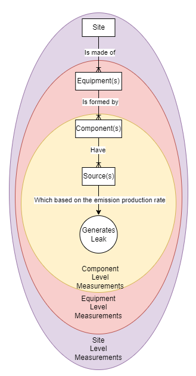

# LDAR-Sim Documentation for Input Parameters and Data

Github Repository: LDAR-Sim

Version: 4.0

Branch: Master

Document Custodian: Sally Jang

Email: <sally@highwoodemissions.com>

--------------------------------------------------------------------------------

## Table of Contents

- [LDAR-Sim Documentation for Input Parameters and Data](#ldar-sim-documentation-for-input-parameters-and-data)
  - [Table of Contents](#table-of-contents)
  - [1. Read this first](#1-read-this-first)
    - [Notes for Developers](#notes-for-developers)
  - [2. Introduction](#2-introduction)
  - [3. File Structure](#3-file-structure)
  - [4. Introducing Parameter Files](#4-introducing-parameter-files)
    - [Parameter file usage](#parameter-file-usage)
    - [Parameter Hierarchy](#parameter-hierarchy)
    - [Versioning of Parameter Files](#versioning-of-parameter-files)
    - [Parameter File Formats](#parameter-file-formats)
  - [5. Simulation Settings](#5-simulation-settings)
    - [\<parameter\_level\> (simulation\_settings)](#parameter_level-simulation_settings)
    - [\<version\> (simulation\_settings)](#version-simulation_settings)
    - [\<input\_directory\>](#input_directory)
    - [\<output\_directory\>](#output_directory)
    - [\<baseline\_program\>](#baseline_program)
    - [\<reference\_program\> WIP](#reference_program-wip)
    - [\<processes\_count\>](#processes_count)
    - [\<simulation\_count\>](#simulation_count)
    - [\<preseed\_random\>](#preseed_random)
  - [6. Output Settings](#6-output-settings)
    - [\<parameter\_level\> (outputs)](#parameter_level-outputs)
    - [\<version\> (outputs)](#version-outputs)
  - [7. Virtual World Setting](#7-virtual-world-setting)
  - [8. Program Inputs](#8-program-inputs)
    - [\<parameter\_level\> (programs)](#parameter_level-programs)
    - [\<version\> (programs)](#version-programs)
    - [\<program\_name\>](#program_name)
    - [\<method\_labels\>](#method_labels)
    - [\<economics\>](#economics)
      - [\<carbon\_price\_tonnes\_CO2\_equivalent\> WIP](#carbon_price_tonnes_co2_equivalent-wip)
      - [\<global\_warming\_potential\_CH4\> WIP](#global_warming_potential_ch4-wip)
      - [\<sale\_price\_of\_natural\_gas\> WIP](#sale_price_of_natural_gas-wip)
      - [\<verification\_cost\> WIP](#verification_cost-wip)
    - [\<duration\_estimate\>](#duration_estimate)
      - [\<duration\_factor\> WIP](#duration_factor-wip)
      - [\<duration\_method\>](#duration_method)
  - [9. Method Inputs](#9-method-inputs)
    - [\<parameter\_level\> (methods)](#parameter_level-methods)
    - [\<version\> (methods)](#version-methods)
    - [\<method\_name\>](#method_name)
    - [\<measurement\_scale\>](#measurement_scale)
    - [\<deployment\_type\>](#deployment_type)
    - [\<sensor\>](#sensor)
      - [\<type\>](#type)
      - [\<quantification\_error\>](#quantification_error)
      - [\<minimum\_detection\_limit\> (default)](#minimum_detection_limit-default)
      - [\<minimum\_detection\_limit\> (OGI\_camera\_rk)](#minimum_detection_limit-ogi_camera_rk)
      - [\<minimum\_detection\_limit\> (OGI\_camera\_zim)](#minimum_detection_limit-ogi_camera_zim)
      - [\<minimum\_detection\_limit\> (METEC\_no\_wind)](#minimum_detection_limit-metec_no_wind)
    - [\<coverage\>](#coverage)
      - [\<spatial\>](#spatial)
      - [\<temporal\>](#temporal)
    - [\<cost\>](#cost)
      - [\<per\_day\>](#per_day)
      - [\<per\_site\>](#per_site)
      - [\<upfront\>](#upfront)
    - [\<crew\_count\>](#crew_count)
    - [\<consider\_daylight\>](#consider_daylight)
    - [\<surveys\_per\_year\> _(propagating parameter)_](#surveys_per_year-propagating-parameter)
    - [\<survey\_time\> _(propagating parameter)_](#survey_time-propagating-parameter)
    - [\<max\_workday\>](#max_workday)
    - [\<reporting\_delay\>](#reporting_delay)
    - [\<time\_between\_sites\>](#time_between_sites)
      - [file (time\_between\_sites)](#file-time_between_sites)
      - [values (time\_between\_sites)](#values-time_between_sites)
    - [\<scheduling\>](#scheduling)
      - [\<deployment\_months\>](#deployment_months)
      - [\<deployment\_years\>](#deployment_years)
    - [\<weather\_envelopes\>](#weather_envelopes)
      - [\<precipitation\>](#precipitation)
      - [\<temperature\>](#temperature)
      - [\<wind\>](#wind)
    - [\<is\_follow\_up\>](#is_follow_up)
    - [\<follow\_up\>](#follow_up)
      - [\<preferred\_method\>](#preferred_method)
      - [\<delay\> (follow\_up)](#delay-follow_up)
      - [\<instant\_threshold\>](#instant_threshold)
      - [\<interaction\_priority\>](#interaction_priority)
      - [\<proportion\>](#proportion)
      - [\<redundancy\_filter\>](#redundancy_filter)
      - [\<sort\_by\_rate\>](#sort_by_rate)
      - [\<threshold\>](#threshold)
  - [10. Virtual World Defining Files](#10-virtual-world-defining-files)
  - [11. Legacy Inputs](#11-legacy-inputs)
    - [Simulation Settings Parameters](#simulation-settings-parameters)
      - [\<pregenerate\_leaks\>](#pregenerate_leaks)
      - [\<print\_from\_simulation\>](#print_from_simulation)
      - [\<outputs\>](#outputs)
      - [\<site\_visits\>](#site_visits)
      - [\<leaks\>](#leaks)
      - [\<sites\>](#sites)
      - [\<timeseries\>](#timeseries)
      - [\<plots\>](#plots)
      - [\<batch\_reporting\>](#batch_reporting)
      - [\<make\_plots\>](#make_plots)
    - [Virtual World Settings Parameters](#virtual-world-settings-parameters)
      - [\<consider\_venting\>](#consider_venting)
      - [\<weather\_is\_hourly\>](#weather_is_hourly)
      - [\<infrastructure\_file\>](#infrastructure_file)
      - [\<subtype\_file\>](#subtype_file)
      - [\<leak\_dist\_params\>](#leak_dist_params)
      - [\<leak\_dist\_type\>](#leak_dist_type)
      - [\<leak\_file\>](#leak_file)
      - [\<leak\_file\_use\>](#leak_file_use)
      - [\<max\_leak\_rate\>](#max_leak_rate)
      - [\<units\>](#units)
      - [\<n\_init\_leaks\_prob\>](#n_init_leaks_prob)
      - [\<n\_init\_days\>](#n_init_days)
      - [\<subtype\_leak\_dist\_file\>](#subtype_leak_dist_file)
      - [\<subtype\_times\_file\>](#subtype_times_file)
      - [\<vent\_file\>](#vent_file)
  - [12. Data sources, modelling confidence and model sensitivity](#12-data-sources-modelling-confidence-and-model-sensitivity)
    - [Duty Holder / Operator (historical LDAR data)](#duty-holder--operator-historical-ldar-data)
    - [Duty Holder / Operator (organizational data)](#duty-holder--operator-organizational-data)
    - [Technology / Solution Provider / Operator (if self-performing LDAR)](#technology--solution-provider--operator-if-self-performing-ldar)
    - [Modeling Expert](#modeling-expert)
  - [13. References](#13-references)

--------------------------------------------------------------------------------

## 1\. Read this first

Please note the following before reading, using, or modifying this document:

- The purpose of this document is to introduce LDAR-Sim, provide guidance for use, and catalogue input parameters, files, data, and arguments required to run the LDAR-Sim model.
- The document you are now reading will _always_ be associated with a specific version or branch of LDAR-Sim. Multiple versions of this document therefore exist, as multiple versions and sub-versions of LDAR-Sim exist.
- **If you are submitting a pull request to the public LDAR-Sim repo**, please update this documentation alongside modifications to code. Your pull request will not be approved without updating this document with relevant changes to inputs, how they work, and their implications for outputs.
- For more information on LDAR-Sim, including code, instructions, and additional resources, please visit the Github page by [clicking this link](https://github.com/LDAR-Sim/LDAR_Sim).
- If you find any errors or inaccuracies in this documentation or in LDAR-Sim, please contact the document custodian (email included above) or leave a ticket in the Git Issues [link](https://github.com/LDAR-Sim/LDAR_Sim/issues).
- The parameter descriptions in this document are provided in an order matching that of parameters in the default parameter files. When updating this document to add new parameters descriptions, ensure the ordering is correct.
- _**Useful tip for searching the document:**_ If searching for the entry describing as specific parameter as opposed to to searching for mentions of that parameter, search for <parameter_name> to uniquely match the entry describing the parameter, instead of any mention of it.

--------------------------------------------------------------------------------

### Notes for Developers

If you are developing in LDAR-Sim, please adhere to the following rules:

1. All parameters must be documented, refer to the examples below on the precise format.

2. All parameters must sit in a key-value hierarchy that semantically makes sense and can be understood by the diversity of users that use LDAR-Sim.

3. All parameter files require `parameter_level` to define the position within the hierarchy.

4. If adding new functionality - The version change associated with the change in functionality must be a Major or Minor version change, accompanied by a software release. This allows for users to download and run the version compatible with legacy parameters if required in the future. Any parameters changed or removed must be documented in Legacy Parameters in the user manual. Developers should aim to support backwards compatibility wherever reasonable.

5. Please do not modify parameters in the program during simulation - consider parameters as 'read only' throughout the simulation.

--------------------------------------------------------------------------------

## 2\. Introduction

To reduce fugitive methane emissions from the oil and gas (O&G) industry, companies implement leak detection and repair (LDAR) programs across their asset base. Traditionally, regulators have specified the use of close-range methods such as the U.S. Environmental Protection Agency's (EPA) Method 21 or Optical Gas Imaging (OGI) cameras for component-level surveys in LDAR programs. These methods remain widely approved by regulators and are effective, however, they are also time consuming and labor intensive. New methane detection and measurement technologies that incorporate satellites, aircraft, drones, fixed sensors, and vehicle-based systems have emerged that promise to deliver faster and more cost-effective LDAR. Before applying these technologies and their work practices in LDAR programs, operators and regulators may wish to estimate anticipated emissions reductions and costs. Regulators often require demonstration of equivalence – that the proposed alternative will achieve at least the same emissions reductions as incumbent regulatory methods. To support this process, the Leak Detection and Repair Simulator (LDAR-Sim) was developed at the University of Calgary to evaluate the emissions reduction potential of alternative LDAR programs.

LDAR-Sim is a computer model that simulates an asset base of oil and gas facilities, the emissions they produce, and the work crews that use different technologies and methods to find and repair leaks. LDAR-Sim replicates the complex reality of LDAR in a virtual world and allows users to test how changes to facilities or the applications of different technologies and methods might affect emissions reductions and LDAR program costs.

To support wider use of LDAR-Sim, the University of Calgary and Highwood Emissions Management have partnered to expand the model's capabilities and stakeholder accessibility through the IM3S Project. This document describes how to use LDAR-Sim and details the model's input data definitions, requirements, and formats. For each input parameter, the data type, defaults, and a detailed description are provided, as well as additional information about data acquisition and limitations. The parameter list comprises general inputs such as weather, leak rates, and facility coordinates, as well as those specific to individual close-range and screening methods like cost-per-day and follow-up thresholds. All inputs, whether empirical distributions or Boolean logic, are customizable. Recommended defaults are described.

By detailing the model inputs, this report creates the technical foundation for adding new functionality and enabling wider use of the model. This document will be revised continuously as modules, inputs, and functionality are added to or removed from LDAR-Sim.

--------------------------------------------------------------------------------

## 3\. File Structure

_TODO_ update when structure is finalized

The LDAR-Sim software is organized using the following structure:

- Root(LDAR_Sim)
  - inputs
  - install
  - outputs
  - src
  - simulations
  - external_sensors

- CHANGELOG.md
- ParameterMigrationGuide.md
- LICENSE.txt
- README.md
- USER_MANUAL.md
- INSTALL_GUIDE.md

The **Root** folder includes all code, inputs, and outputs necessary to run LDAR-Sim. From a software perspective, the root folder is the parent to the src folder (folder containing LDAR_sim_main). This folder will be always be the root folder when making relative references in LDAR-Sim. For example, if input_directory is specified as _./inputs_ from anywhere in the code, the targeted folder will be _{absolute_path_to} / Root / inputs_.

The **inputs** folder contains input files required to run LDAR-Sim. These include weather files, empirical emission and vent data, facility lists, and other inputs.

The **outputs** folder stores all output data files produced by LDAR-Sim. The folder is cleaned, and added if required each time ldar_sim_main is run.

The **src** folder stores the python source code. The main code of LDAR-Sim, LDAR_sim_main.py is stored in the base folder of src.

The **external_sensors** folder contains python source code for alternative technology sensors that users are free to use and add to.

The **simulations** stores sample V4.0 input parameter files.

--------------------------------------------------------------------------------

To set up the model, follow the [installation guide](INSTALL_GUIDE.md) provided.

--------------------------------------------------------------------------------

To run the model, supply one or more input parameter files as arguments to the program. The main function is called `ldar_sim_run.py` and is the main entrypoint to the model. File paths can be relative to the root directory (e.g., `./parameter_file1.yaml`) or absolute (e.g., `D://parameter_files//parameter_file1.yaml`). File paths are positional arguments and should be separated by a single space.

```buildoutcfg
python ldar_sim_run.py parameter_file1.yaml parameter_file2.yaml
```

Alternatively, a single folder name (absolute or relative to root) can be passed by flagged argument _-P_ or _--in_dir_. All json or yaml files within that folder will be added as parameter_files. For example, the following will use all parameter files within the sample simulation folder:

```buildoutcfg
python ldar_sim_run.py --in_dir ./simulations
```

We recommend running the model with a working directory set to /LDAR_Sim/src.

Optionally, a single folder name (absolute or relative to root) can be passed by flagged argument _-X_ or _--out_dir_. All output files will be added as outputs in that directory. For example, the following will save all output files within the "out" folder:

```buildoutcfg
python ldar_sim_run.py --in_dir ./simulations --out_dir ./out
```

--------------------------------------------------------------------------------

## 4\. Introducing Parameter Files

Parameter files are all key-value pairs (i.e., Python dictionary), with multiple levels of nesting. The model runs with 4 main levels in a hierarchy:

- `simulation setting`: global simulation setting parameters that are common across all programs in a simulation or set of simulations such as system parameters, etc.
- `virtual world`: virtual world parameters that are used to create the virtual world which the different emissions reduction programs are applied to.
- `program`: program parameters that are used to define a specific emissions reduction program (or lack thereof). Commonly, an 'alternative' custom program is compared to a defined regulatory program. Many programs can be compared at once.
- `method`: emissions reduction methods (e.g., specific LDAR technologies and work practices and/or LDAR service provider companies) that are deployed within a program. Methods are specified in a given program for deployment and multiple methods may be used at once (e.g., satellite + aircraft + OGI follow-up + routine AVO)

A typical simulation would compare at least two programs: a reference program and one or more test programs. Including a baseline program is also necessary.

- `baseline program`: The program against which mitigation is estimated for reference and test programs (mitigation = baseline emissions - LDAR emissions). Typically involves running LDAR-Sim in the absence of a formal LDAR program (commonly denoted as 'P_none'). Even without a formal LDAR program, emissions are eventually removed from the simulation due to operator rounds (e.g., AVO), routine maintenance, refits and retrofits, or other factors.
- `reference program`: The program against which test programs are compared (e.g., to establish equivalency). The reference program is often defined by regulations that require the use of OGI (commonly denoted 'P_OGI').
- `test programs`: A custom alternative program that the user wants to evaluate. Commonly denoted using 'P_' + program name (e.g., 'P_aircraft', 'P_GasCompanyX', 'P_drone', etc.).

A simulation can consist of any number of programs and each program can consist of any number of methods. For example, the reference program could deploy one method (OGI). The test program could deploy two new LDAR methods (magical helicopter and un-magical binoculars). Each program would be run on the asset base multiple times through time to create a statistical representation of the emissions and cost data. Finally, the statistical emissions and cost distributions of the reference program can be compared to those of the test program. It is often the differences between the programs that represents the important information that is of interest to users of LDAR-Sim.

In this example, the hierarchy looks like:

```yaml
Simulation setting parameters
Virtual world parameters
Programs:
    Baseline program
    Reference program:
        Reference LDAR method (OGI)
    Test program:
        New LDAR method 1 (Magical Helicopter)
        New LDAR method 2 (Un-magical Binoculars)
```

--------------------------------------------------------------------------------

### Parameter file usage

We recommend supplying LDAR-Sim with a full set of parameters, copied from the default parameters in the `default_parameters` folder and modified for your purposes. This will ensure you are familiar with the parameters you have chosen to run the model.

However, it may be more convenient once you are familiar with how parameter files update each other to use multiple parameter files to create your simulations and rely upon the default parameters.

All simulations using multiple parameter files are created the following way:

_TODO_ Possibly insert the data flow chart here?

--------------------------------------------------------------------------------

### Parameter Hierarchy

As noted previously, LDAR-Sim usues a 4 level hierarchy of simulations, virtual world, programs and methods parameters. To tell LDAR_Sim what level in the hierarchy your parameter file is destined for, you must specify a `parameter\_level` parameter that will specify what level your paremeter file is aimed at.

The `parameter_level` parameter can be one of three values:

- `simulation_settings`: parameters are aimed at the simulation setting level.
- `virtual_world`: parameters are used to define the virtual world.
- `program`: parameters are used to define a program.
- `method`: parameters are used to define a method and update a given method by name.

--------------------------------------------------------------------------------

### Versioning of Parameter Files

All parameter files must specify a version to enable mapping. This versioning is used to allow code to verify that a compatible version of the parameters is being used. If the parameter version is incompatible, the software will output an error message with further instructions on where to find guidance on input parameter mapping to the latest version.

Refer to `input_mapper_v1.py` for a template file and discussion document on input parameter mapping from V1.0 to V2.0.

Refer to [ParameterMigrationGuide](ParameterMigrationGuide.md) for instructions on how to migrate parameters from v2.x.x to V3.0 and from V3.0 to V4.0. Reverse compatibility mapping only exists for minor parameter versions within the same major LDAR-Sim version (For example LDAR_Sim version 3.0 is not compatible with version 2.x.x parameters).

--------------------------------------------------------------------------------

### Parameter File Formats

LDAR-Sim includes a flexible input parameter mapper that accepts a variety of input parameter formats. Choose the one that you like the best. [YAML](https://en.wikipedia.org/wiki/YAML) is the easiest to read for humans, allows inline comments, and is recommended.

The following formats are accepted:

- yaml files (extension = '.yaml' or '.yml')
- json files (extension = '.json')

For example, here is a program definition in yaml:

```buildoutcfg
version: '4.0'
parameter_level: program
name: awesome_program
```

Here is the same program definition in json:

```buildoutcfg
{
    "version": "4.0",
    "parameter_level": "program",
    "name": "awesome_program"
}
```

Note that programs are interpreted as a flat list of parameters that are incorporated into a list where methods have one parameter (the method name), and other method parameters nested below.

--------------------------------------------------------------------------------

## 5\. Simulation Settings

### &lt;parameter_level&gt; (simulation_settings)

**Data Type:** String

**Default input:** 'simulation_settings'

**Description:** A string indicating the parameters in file are at the simulation settings level

**Notes on acquisition:** No data acquisition required.

**Notes of caution:** Must be set to ```parameter_level: simulation_settings``` for a simulation setting parameter file.

### &lt;version&gt; (simulation_settings)

**Data type:** String

**Default input:** 4.0

**Description:** Specify version of LDAR-Sim. See section _[Versioning of Parameter Files](#versioning-of-parameter-files)_ for more information.

**Notes on acquisition:** N/A

**Notes of caution:** Improper versioning will prevent simulator from executing.

### &lt;input_directory&gt;

**Data type:** String

**Default input:** "./inputs"

**Description:** Specifies the folder/directory containing virtual world defining files like the[emissions_file](#emissions_file), [sites_file](#sites_file), etc. Accepts either an absolute path or a relative path from the root folder.

**Notes on acquisition:** N/A

**Notes of caution:** N/A

### &lt;output_directory&gt;

**Data type:** String

**Default input:** './outputs'

**Description:** Specifies the folder/directory to generate output files into. Accepts either an absolute path or a relative path from the root folder.

**Notes on acquisition:** It is recommended for the `output_directoy` be specified for each simulation that is ran.

**Notes of caution:** The contents of the existing folder is **removed** and **overwritten**. Rename folders to ensure that old output files are not lost.

### &lt;baseline_program&gt;

**Data type:** String

**Default input:** 'P_none'

**Description:** Refers to a [name of a program](#program_name) that is a part of the simulation. Results requiring a reference point for comparison, such as mitigation efforts, will be derived by comparing the output values from this program.

**Notes on acquisition:** Typically a program that represents a scenario where there is no formal LDAR or that has no LDAR method is recommended as the baseline program. Simply put, create a program with no methods.

**Notes of caution:** A baseline program is required to successfully run the simulation.

### &lt;reference_program&gt; WIP

**Data type:** String

**Default input:** 'P_OGI'

**Description:** Refers to a [name of a program](#program_name), against which alternative programs are compared.

**Notes on acquisition:** N/A

**Notes of caution:** N/A

### &lt;processes_count&gt;

**Data type:** Numeric (Integer)

**Default input:** 6

**Description:** The maximum number of parallel tasks or processes that the simulator can use simultaneously. To simplify, this is the limit of how many different tasks the simulator can handle at a given time.

**Notes on acquisition:** In general, many modern computers can effectively handle around 6 concurrent processes without significant performance issues. This number is influenced by factors such as the computer's hardware specifications, operating system efficiency, and the resource demands of the individual processes.

**Notes of caution:** Python is limited and cannot achieve true simultaneous execution of Python code. Therefore, generating too many processes may cause slower performance due to excessive context switching between the different processes.

A minimum of a single process is required for the simulation to run.

### &lt;simulation_count&gt;

**Data type:** Numeric (Integer)

**Default input:** 2

**Description:** The number of simulation rounds to execute for the given programs.

**Notes on acquisition:** Increasing the number of simulations improves result accuracy but extends the runtime.

**Notes of caution:** For critical scenarios that are intended to guide decision-making, we recommend running a significant number of simulations for each modeled scenario. A minimum of 50 simulations is advised to ensure a robust comparison of different LDAR programs.

To generate meaningful and reliable data output from the simulator, it's important to aim for a substantial number of annual data points. We recommend aiming for at least 400 annual data points. This can be achieved by adjusting the number of simulation iterations and the duration of the simulations. For instance, you could run 100 iterations of a 4-year-long simulation. Alternatively, you can employ any combination that suits your specific needs, as long as it results in a sufficient number of data points.

### &lt;preseed_random&gt;

**Data type:** Boolean

**Default input:** False

**Description:** If enabled, a series of random integers, acting as the 'seed', will be generated. These integers guarantee the reproducibility of all randomly generated values. For instance, future simulations utilizing the same virtual world parameters alongside the specified 'seed' will produce identical emission sets.

**Notes on acquisition:** N/A

**Notes of caution:** It is advisable to set `preseed_random: True` for any simulation results that will require referencing and duplication in the future.

--------------------------------------------------------------------------------

## 6\. Output Settings

### &lt;parameter_level&gt; (outputs)

**Data Type:** String

**Default input:** 'outputs'

**Description:** A string indicating the parameters in file are at the output settings level

**Notes on acquisition:** No data acquisition required.

**Notes of caution:** Must be set to ```parameter_level: outputs``` for an output setting parameter file.

### &lt;version&gt; (outputs)

**Data type:** String

**Default input:** 4.0

**Description:** Specify version of LDAR-Sim. See section _[Versioning of Parameter Files](#versioning-of-parameter-files)_ for more information.

**Notes on acquisition:** N/A

**Notes of caution:** Improper versioning will prevent simulator from executing.

_TODO_

--------------------------------------------------------------------------------

## 7\. Virtual World Setting

--------------------------------------------------------------------------------

## 8\. Program Inputs

### &lt;parameter_level&gt; (programs)

**Data Type:** String

**Default input:** 'programs'

**Description:** A string indicating the parameters in file are at the program settings level

**Notes on acquisition:** No data acquisition required.

**Notes of caution:** Must be set to ```parameter_level: programs``` for an output setting parameter file.

### &lt;version&gt; (programs)

**Data type:** String

**Default input:** 4.0

**Description:** Specify version of LDAR-Sim. See section _[Versioning of Parameter Files](#versioning-of-parameter-files)_ for more information.

**Notes on acquisition:** N/A

**Notes of caution:** Improper versioning will prevent simulator from executing.

### &lt;program_name&gt;

**Data Type:** String

**Default input:** "default"

**Description:** The name of the program. Typical naming convention is to include "P_" before a name.

**Notes on acquisition:** N/A

**Notes of caution:** Each program must have a unique program name. If names are duplicated, they will override each other.

### &lt;method_labels&gt;

**Data Type:** List[strings]

**Default input:** []

**Description:** A list of the methods used within the program. For example, the following will use the aircraft and the OGI_FU methods:

```yaml
method_labels:
- aircraft
- OGI_FU
```

The following is an alternative format for the same example:

```yaml
method_labels: ["aircraft","OGI_FU"]
```

**Notes on acquisition:** N/A

**Notes of caution:** The method labels that are referenced must be identical to an existing [method_name](#method_name), it is case sensitive.

### &lt;economics&gt;

**Description** Economic values that are used to generate cost related figures.

**Note:** The following economics parameters are currently placeholders and will be reimplemented in a future patch.

#### &lt;carbon_price_tonnes_CO2_equivalent&gt; WIP

**Data Type:** Numeric

**Default input:** 65.0

**Description:** The federal price on carbon in Canada of $65/tonne CO2e (as of April 2023) is input as a default metric to compare the cost to mitigation ratios of LDAR programs to.

**Notes of acquisition:** The current fuel charge rates for Canada can be found [here](https://www.canada.ca/en/revenue-agency/services/forms-publications/publications/fcrates/fuel-charge-rates.html), and the rates for the United States can be found [here](https://www.eia.gov/petroleum/gasdiesel/).

**Notes of caution:**  This rate rises annually and should be updated in the model to reflect changes in the price.

#### &lt;global_warming_potential_CH4&gt; WIP

**Data Type:** Numeric

**Default input:** 28.0

**Description:** GWP of 28 over a 100-year time period was chosen as a default input. The model uses this value to convert between CH4 and CO2e when required. This value can be changed to 84-86 over 20 years to explore the impact that GWP has on mitigation costs.

**Notes of acquisition:** This value is from [Chapter 8](https://www.ipcc.ch/site/assets/uploads/2018/02/WG1AR5_Chapter08_FINAL.pdf) in the IPCC's Assessment Report 5 from Working Group 1 page 714, 2018.

**Notes of caution:** Using a GWP of CH4 for a 20-year time period may dramatically change results but all options should be explored.

#### &lt;sale_price_of_natural_gas&gt; WIP

**Data Type:** Numeric

**Default input:** 3.0

**Description:** The sale price of natural gas per thousand cubic foot (mcf) which is used to calculate the potential value of gas sold when captured as part of an LDAR program. LDAR-Sim takes the difference in emissions from a baseline scenario and multiplies this by the price of natural gas.

**Notes of acquisition:** This value can be taken from local distribution companies or natural gas trading hubs. The U.S. Energy Information Administration is a good source for this information but units need to be converted to mcf before input into the model.

**Notes of caution:** The default value of $3/mcf is a conservative estimate and users of LDAR-Sim will see different cost/benefit and cost/mitigation results if the price of natural gas is changed.

#### &lt;verification_cost&gt; WIP

**Data Type:** Numeric

**Default input:** 0

**Description:** The average cost of repair verification. This value is added to the total program cost each time a repair is verified. Some regulations require verification of successful repair within a certain number of days following repair. If the operator is already onsite and can easily verify the repair with readily available instruments (e.g., FID), the cost of verification could be negligible. If the operator has to drive long distances or engage an independent service provider to verify repairs, costs could be high.

**Notes of acquisition:** The duty holder should have data on cost of verification.

**Notes of caution:** N/A

### &lt;duration_estimate&gt;

**Description:** The following parameters are used to estimate the total emission amount according to the specified program's work practices.

#### &lt;duration_factor&gt; WIP

**Data Type:** Numeric

**Default input:** 1

**Description:** A decimal number representing the ratio of time since the last survey or screening at a given site, used to estimate the duration of a given measurement.

For example, a value of 0.5 means that all measurements are based on the assumption that half the time since the last survey or screening at a given site is used to estimate the duration of the measured emission.

By default(1), it assumes that the estimated emission has been emitting since the last screening or survey.

```txt
Scenario
- A given site was surveyed January 1st, and 31st.
- It recorded 0kg/day and 5kg/day for the respective dates.

If duration_factor is set to 0.5:
  - The estimated volume emitted would be calculated by the following
      ((31 - 1) * 0.5)days * 5kg/day = 75 kg

If the duration_factor is set to 1:
  - The estimated volume emitted for the same period would be 
      ((31 - 1) * 1)days * 5kg/day = 150 kg

```

**Notes of acquisition:** N/A

**Notes of caution:** This is currently a placeholder parameter.

#### &lt;duration_method&gt;

**Data Type:** String

**Default input:** "component-based"

**Description:** A string that specifies how the program as a whole will estimate the total emissions measured.

**`component-based`**- Only component level measurement work practices will be considered for estimating total emissions.

For example, if a given program uses two mobile methods, `A` and `B`, where `A` is a component-level survey and `B` is a site-level screening:

- `A` surveys `site_1` on January 1st and 30th, finding an emission on the 30th.
- `B` surveys `site_1` on January 15th.

The emission would be estimated to have lasted since January 1st, as that is the last valid component-level measurement conducted.

**`measurement-based-conservative`**- All methods are considered valid for estimating the total emissions measured.

For example, if a given program uses two mobile methods, `A` and `B`, where `A` is a component-level survey and `B` is a site-level screening:

- `A` surveys `site_1` on January 1st and 30th, finding an emission on the 30th.
- `B` surveys `site_1` on January 15th.

The measured total site level emission rate on January 30th is assumed to have lasted since January 15th.

**Notes of acquisition:** Currently the two valid duration estimation methods are `component-based` and `measurement-based-conservative`.

**Notes of caution:** All emissions estimation in simulation is based on the assumption that technologies quantify emissions.

--------------------------------------------------------------------------------

## 9\. Method Inputs

### &lt;parameter_level&gt; (methods)

**Data Type:** String

**Default input:** 'methods'

**Description:** A string indicating the parameters in file are at the methods settings level

**Notes on acquisition:** No data acquisition required.

**Notes of caution:** Must be set to ```parameter_level: methods``` for a methods setting parameter file.

### &lt;version&gt; (methods)

**Data type:** String

**Default input:** 4.0

**Description:** Specify version of LDAR-Sim. See section _[Versioning of Parameter Files](#versioning-of-parameter-files)_ for more information.

**Notes on acquisition:** N/A

**Notes of caution:** Improper versioning will prevent simulator from executing.

### &lt;method_name&gt;

**Data type:** String

**Default input:** _placeholder_str_ (Required to be set for each method added to program)

**Description:** A character string denoting the label of the method.

**Notes on acquisition:** No data acquisition required.

**Notes of caution:** Must match the label name specified in the program input parameter file, and any supplementary files, such as the infrastructure file. This is a case sensitive parameter. It is important to note that different programs can call the same method files, provided that the work practices and technology involved are parameterized identically.

### &lt;measurement_scale&gt;

**Data type:** String

**Default input:** _placeholder_str_ (Required to be set for each method added to program)

**Description:** A character string describing the measurements scale. Possible inputs are `"component"`, `"equipment"`, and `"site"`.

- `component` level measurement scale technologies are able to measure the sum of emissions at a given component
- `equipment` level measurement scale technologies are able to measure the sum of emissions at a given equipment of a site
- `site` level measurement scale technologies measure the sum of the emissions of a given site

The following figure shows a graphical representation:



**Notes on acquisition:** No data acquisition required.

**Notes of caution:** Only component scale methods are able to tag emissions for repair.

### &lt;deployment_type&gt;

**Data type:** String

**Default input:** _placeholder_str_ (Required to be set for each method added to program)

**Description:** Methods are comprised of both a deployment type and a sensor type. The deployment type is a character string denoting the deployment type used in the method. For instance, `'mobile'` or `'stationary'`. Custom deployment types can be added and referenced here.

Valid deployment types:

- `mobile`: Agent moves between sites. Surveys occur when a site is "ready" for a survey and a crew is available to survey.
- `stationary`: Each site has one or more _fixed_ sensors. Surveys are carried out daily.

**Notes on acquisition:** No data acquisition required.

**Notes of caution:** N/A

### &lt;sensor&gt;

**Description:** The parameters within this section are for specifying the measurement technology utilized in the simulation.

#### &lt;type&gt;

**Data type:** String

**Default input:** "default"

**Description:** Methods are comprised of both a deployment type and a sensor type. the sensor type is a character string denoting the sensor used in the method. For instance, `'OGI_camera_zim'`,`'OGI_camera_rk'`, or `'default'`. The `'default'` sensor uses the minimum detection limit (MDL) as a threshold to detect emissions based on the measurement scale of the method. Custom sensors can be added and referenced here. Built in sensors are:

- `default`: Uses a simple threshold where the emission rate is based on the measurement scale, for example if `measurement_scale = site` then the site's total emissions will be considered measured if greater than the sensors MDL.
- `OGI_camera_rk`: Uses detection curve based on Ravikumar, 2018. Requires [measurement_scale](#measurement_scale) = `'component'`.
- `OGI_camera_zim`: Uses detection curve based on Zimmerle 2020. Requires [measurement_scale](#measurement_scale) = `'component'`.
- `METEC_no_wind`: Uses a detection curve formula based on a typical METEC report where wind is normalized.

**Notes on acquisition:** No data acquisition required.

**Notes of caution:** N/A

#### &lt;quantification_error&gt;

**Data type:** Numeric

**Default input:** 0

**Description:** _TODO_ The standard deviation of a normal distribution with a mean of zero from which a quantification error multiplier is drawn each time an emission rate is estimated. For example, for a value of 2.2, ~35\% of measured emission rates will fall within a factor of two of the true emission rate. For a value of 7.5, ~82\% of measurements will fall within an order of magnitude of the true emission rate. When QE = 0, the measured emission rate equals the true emission rate. As QE increases, so does the average absolute difference between measured and true emission rates. See Fox et al. (2021) for more information and Ravikumar et al. (2019) for empirical quantification error estimates.

**Notes on acquisition:** We recommend extensive controlled release testing under a range of representative release rates, distances, and conditions to establish quantification error. Given the amount of work required to collect this information, we recommend using historical estimates.

**Notes of caution:** As facility-scale quantification error remains poorly constrained for LDAR screening methods, and likely depends on work practice, dispersion modeling, and environment, screening programs should be evaluated using a range of possible quantification errors. We recommend understanding exactly how quantification error works before making use of this functionality. Alternatively, we suggest using literature values of 2.2 and 7.5.

#### &lt;minimum_detection_limit&gt; (default)

**Data type:** List of integers

**Default input:** [0.01] (Should be set for each Method)

**Description:** Minimum detection limit of the screening method in grams per second. Probability curves or surfaces as a function of emission rate, wind speed, distance, etc. must be hard coded.

**Notes on acquisition:** We recommend extensive controlled release testing under a range of representative release rates, distances, and conditions to establish detection limits. Given the amount of work required to collect this information, we recommend using historical estimates.

**Notes of caution:** A single value for MDL is used here, although a parameter list could be used that defines a sigmoidal probability of detection curve. These are examples and with more experimental data, probability of detection surfaces can be generated that can estimate detection probabilities as a function of numerous relevant variables (e.g., distance, wind speed, emission rate, etc.)

#### &lt;minimum_detection_limit&gt; (OGI_camera_rk)

**Data type:** List of floats

**Default input:** [0.01275, 0.00000278]

**Description:** A list of parameters [_xₒ_, σ] that define the minimum detection limit of OGI. The two parameters define a sigmoidal Gaussian cumulative probability function as described in Ravikumar et al. (2018), where _xₒ_ is the emission rate (in grams per second) at which 50% of emissions are detected (i.e., median detection limit), and σ is one standard deviation of  _xₒ_. The probability detection of an emission with OGI is calculated using a sigmoidal probability function:

$$
f = \frac{1}{(1+exp(-k(log(x)-log(x_0))))}
$$

where f = is the fraction of emissions detected, _x_ is the emission rate in grams of methane per hour, _xₒ_ is the median detection limit (f = 0.5) and _k_ is the steepness of the sigmoid curve. Ravikumar et al. (2018) found that at 3 m _k_ =  4.9 g/hr +/- 3, and _xₒ_ = 0.47 +/- 0.1. However, detection limits were found to be an order of magnitude higher in the Zimmerle study. As such, LDAR-Sim assumes an _xₒ_ of 0.01275 g/s. For reasons listed below, we note that this is likely a conservative estimate. Also, this approach assumes a constant distance of 3 meters from camera to source.

**Notes on acquisition:** If no input is provided for the minimum detection limit (`minimum_detection_limit: []`), the values [0.01275, 0.00000278] will be used for the constants.

We recommend extensive controlled release testing under a range of representative release rates and conditions to establish detection limits. Given the amount of work required to collect this information, we recommend using historical estimates.

**Notes of caution:** Detection probabilities for OGI cameras have been shown to vary with operator experience, wind speed, scene background, and other variables. Estimates from Ravikumar et al. (2018) are experimentally derived but are likely low because (i) the OGI inspector knew where to look, (ii) measurements were performed over only 1 week of good conditions, (iii) OGI cameras were tripod mounted, and (iv) videos were analyzed by experts after data collection. Estimates from Zimmerle et al. (2020) are an order of magnitude higher, and likely closer to reality. However, this estimate applies only to experienced inspectors with over 700 site inspections under their belts, so the true median detection across all inspectors may be lower. Furthermore, the Zimmerle study for experienced inspectors could still represent an underestimate as (i) weather conditions were relatively good, (ii) OGI inspectors were participating in a formal study and were likely very focused, and (iii) many of the emissions were odorized. These results would therefore not include laziness, neglect, or missing of emissions from difficult to access areas. See [minimum_detection_limit(default)](#minimum_detection_limit-default) for more information on detection limits, including the use of single values or probability surfaces.

#### &lt;minimum_detection_limit&gt; (OGI_camera_zim)

**Data type:** List of floats

**Default input:** [0.24, 0.39]

**Description:** A list of parameters [a, b] that define the emissions rate based probability of detection of a emissions. The two parameters define power law cumulative probability function as described in Zimmerle (2020), where both a and b are empirical parameters that define the shape of the curve, and are based on the camera crew experience. The probability detection of an emission with OGI is calculated using the following function:

$$
p = a*x^{b}
$$

where p is the probability of detection, _x_ is the emission rate in grams of methane per second. The default
parameters used are that associated with the moderate ability to detect.

**Notes on acquisition:** If not input is provided for the minimum detection limit (`minimum_detection_limit: []`), the values [0.24, 0.39] will be used.

We recommend extensive controlled release testing under a range of representative release rates and conditions to establish detection limits. Given the amount of work required to collect this information, we recommend using historical estimates.

**Notes of caution:** Detection probabilities for OGI cameras have been shown to vary with operator experience, wind speed, scene background, and other variables. Parameters are experimentally derived. The Zimmerle study for experienced inspectors could still represent an underestimate as (i) weather conditions were relatively good, (ii) OGI inspectors were participating in a formal study and were likely very focused, and (iii) many of the emissions were odorized. These results would therefore not include laziness, neglect, or missing of emissions from difficult to access areas. See Section 3.8 for more information on detection limits, including the use of single values or probability surfaces.

#### &lt;minimum_detection_limit&gt; (METEC_no_wind)

**Data type:** List of floats

**Default input:** []

**Description:** A list of parameters [a, b, _, c] where a and b are constants in the following formula:

$$
p = \frac{1}{1 + e^{a - b * x}}
$$

and `c` represents the optional minimum threshold that the rate must exceed to be considered for detection and `x` represents the emission rate in kilograms of methane per hour.

**Notes on acquisition:** N/A

**Notes of caution:** Detection probabilities have been shown to vary with wind speed, scene background, and other variables. The METEC studies may still underestimate these probabilities, as not all variables can be accounted for in a controlled environment compared to real life working conditions.

### &lt;coverage&gt;

#### &lt;spatial&gt;

**Data type:** Numeric

**Default input:** 1.0

**Description:** Probability (0-1) that a work practice can locate an emission. Internally, each emission will be randomly assigned a True or False value based on this probability indicating whether or not the emission can be detected by the work practice. This value is rolled only once for each emission and work practice pair and remains consistent for subsequent surveys. Spatial coverage is also not affected by emission size.

`eg. coverage.spatial = 0.25`. The emission has a 25% chance of being detected regardless of the number of surveys.

**Notes on acquisition:** N/A

**Notes of caution:** Future research is required!

#### &lt;temporal&gt;

**Data type:** Numeric

**Default input:** 1.0

**Description:** Probability (0-1) that an agent can locate an emission during a survey. Internally, each emission will be randomly assigned a True or False based on this probability increasing survey will improve the chances of the emission being detected.

`eg. coverage.temporal = 0.25`. The emission has a 25% chance of being detected **every time** it is surveyed.

**Notes on acquisition:** N/A

**Notes of caution:** Future research is required!

### &lt;cost&gt;

**Description:** The cost to deploy a given method. The type of currency is not factored but must be consistent across all cost inputs.

#### &lt;per_day&gt;

**Data type:** Numeric

**Default input:** 0

**Description:** The daily cost charged by the service provider (per crew). It is charged each time a crew is deployed, regardless of how many sites they survey that day.

**Notes on acquisition:** No data acquisition required.

**Notes of caution:** N/A

#### &lt;per_site&gt;

**Data type:** Numeric

**Default input:** 0

**Description:** The cost charged by the service provider (per crew per site). It is charged each time a crew is deployed at a site.

**Notes on acquisition:** No data acquisition required.

**Notes of caution:** N/A

#### &lt;upfront&gt;

**Data type:** Numeric

**Default input:** 0

**Description:** The initial up-front cost of each crew. This cost is only charged once.

**Notes on acquisition:** Consult service provider.

**Notes of caution:** Does not account for maintenance activities or the cost of replacing devices at the end of their lifetime.

### &lt;crew_count&gt;

**Data type:**  Numeric (Integer)

**Default input:** 0

**Description:** The maximum number of distinct, independent crews that will be deployed using the same method. If the `crew_count` is not provided, LDAR-Sim will provide crews as needed.

**Notes on acquisition:** No data acquisition required.

**Notes of caution:** Unless explicitly evaluating labour constraints, ensure that sufficient crews are available to perform LDAR according to the requirements set out in the infrastructure_file. For example, if 2000 facilities require LDAR, and each takes an average of 300 minutes, ~10,000 work hours are required, or 3-4 crews working full time.

### &lt;consider_daylight&gt;

**Data type:** Boolean

**Default input:** False

**Description:** A binary True/False to indicate whether crews should only work during daylight hours. If False, crews work the number of hours specified by the [max_workday](#max_workday) input variable used for each method. If True, crews work the shorter of either [max_workday](#max_workday) or the number of daylight hours calculated using the PyEphem package in python using latitude, longitude of each site, for each day of the year.

**Notes on acquisition:** Acquisition is automated using required latitude and longitude coordinates for each facility (see infrastructure_file input) at each time step.

**Notes of caution:** In most cases, True and False will yield similar results. Use of daylight constraints should be considered for companies that do not wish to deploy crews in the dark for safety reasons, especially for locations at high latitudes during winter months (e.g., Northern Alberta). However, this functionality should not be used to determine whether sunlight is available for passive remote sensing methods or other technologies that require sunlight operate, as the sun has already set when civil twilight occurs (see obs.horizon). Solar flux will vary with topography and cloud cover (use ERA5 data).

### &lt;surveys_per_year&gt; _(propagating parameter)_

**Data type:**  Numeric (Integer)

**Default input:** N/A

**Description:** An integer indicating the number of required surveys at each facility per calendar year.

**Notes on acquisition:** Survey frequencies can be based on regulatory requirements, company policies, or can be fabricated by the modeler to explore different scenarios.

**Notes of caution:** Note that just because a number of surveys is prescribed, it does not mean that this number of surveys will necessarily be performed. For example, if labour limitations exist (i.e., not enough crews are available to inspect the number of facilities in the program) or if environmental conditions are unsuitable (i.e., a particular facility is in a cloudy location that cannot be accessed by satellite), the performed number of surveys may be less than the prescribed number. This variable is not required for continuous measurement methods.

**Note:** this parameter may also be set more granularly using the infrastructure files.

### &lt;survey_time&gt; _(propagating parameter)_

**Data type:**  Numeric (Integer)

**Default input:** N/A

**Description:** The number in minutes required to complete a survey or screening at each facility.

**Notes on acquisition:** In most cases, an estimate will be made as data will not exist for the specific combination of facility and unique method. However, as new methods and programs are implemented, data will become available to better refine modeling estimates and develop more intelligent programs.

**Notes of caution:** This variable is an empirical estimate of how much time is required for a given mobile method to complete a survey at a given facility. This includes anything that happens onsite (e.g., calibrations, interfacing with the operator, etc.) but _does not include_ driving time between facilities or any other account of time spent offsite. This variable is simply the amount of time that passes from the start of a facility survey to the end. If a facility takes longer than there is time left in a day, then the agent/crew returns the following day to continue work, and so on and so forth, until the facility is completed. This variable is not required for continuous measurement methods.

**Note:** this parameter may also be set more granularly using the infrastructure files.

### &lt;max_workday&gt;

**Data type:**  Numeric (Integer)

**Default input:** 8

**Description:** The maximum number of hours a crew can work in day (includes travel time).

**Notes on acquisition:** No data acquisition required.

**Notes of caution:** This can be overridden if [consider_daylight](#consider_daylight) is True and the valid daylight hours are shorter.

### &lt;reporting_delay&gt;

**Data type:** Numeric (Integer)

**Default input:** 2

**Description:** The number of days that pass between the end of a survey (when a site is flagged or emissions are tagged) and when the duty holder is informed. The reporting delay is then followed by the [repair delay](#delay).

**Notes on acquisition:** Get this information from the service provider.

**Notes of caution:** Many service providers have automated systems for reporting emissions as soon as they are found and tagged. However, some companies still provide paper or pdf reports days or even weeks later. It is important to understand the expectations between the duty holder and the service provider.

### &lt;time_between_sites&gt;

**Description:** The time between sites can be specified as a list in the parameter file or provided in a CSV file format.

#### file (time_between_sites)

**Data type:** String

**Default input:** None

**Description:** A string denoting the filename of a csv file containing travel times. The file should include one row, with a column header in row 1 of `time_between_sites`

**Notes on acquisition:** Each value should represent not only driving time, but all time spent not conducting surveys (driving, breaks, meals, break downs, trains, etc.) This data should be scraped from historical GPS data associated with LDAR survey crews, ideally for the facilities under evaluation.

**Notes of caution:** These data may be difficult to acquire and may lack representativeness.

#### values (time_between_sites)

**Data type:** List of Integers

**Default input:** [30]

**Description:** The list of numbers denotes the time in minutes required to plan, travel, setup, take down, required in between surveys. A value is selected at random from the provided list.

### &lt;scheduling&gt;

#### &lt;deployment_months&gt;

**Data type:** List of integers

**Default input:** [1,2,3,4,5,6,7,8,9,10,11,12]

**Description:** A list of months used for scheduling. Methods can only be deployed during these months. For example, [8,9] indicates methods can only be deployed in August and September. If not defined, LDAR-Sim assumes methods can be deployed every month.

**Notes on acquisition:** N/A

**Notes of caution:** Only `mobile` [methods](#deployment_type) can use this functionality.

#### &lt;deployment_years&gt;

**Data type:** List of integers

**Default input:** N/A

**Description:** A list of years used for scheduling. Methods can only be deployed during these years. For example, [2017,2018] indicates methods can only be deployed in 2017 and 2018\. If not defined, LDAR-Sim assumes methods can be deployed every year.

**Notes on acquisition:** N/A

**Notes of caution:** Only `mobile` [methods](#deployment_type) can use this functionality.

### &lt;weather_envelopes&gt;

**Description:** The following parameters define the valid weather conditions for the given method.

#### &lt;precipitation&gt;

**Data type:** List of floats

**Default input:** [0, 0.5]

**Description:** The range of precipitation accumulation allowed (mm) over one hour.

**Notes on acquisition:** No data acquisition required.

**Notes of caution:** N/A

#### &lt;temperature&gt;

**Data type:** List of floats

**Default input:** [-40, 40]

**Description:** The range of average hourly temperature (°C) between which crews will work.

**Notes on acquisition:** No data acquisition required.

**Notes of caution:** Units are in degrees Celsius, not Fahrenheit.

#### &lt;wind&gt;

**Data type:** List of floats

**Default input:** [0, 10]

**Description:** The bounding range of maximum average hourly wind speed (m/s at 10m) between which crews will work.

**Notes on acquisition:** No data acquisition required.

**Notes of caution:** N/A

### &lt;is_follow_up&gt;

**Data type:** Boolean

**Default input:** False (Required to be set for each method added to program)

**Description:** A binary True/False to indicate whether the method is used to survey sites previously flagged by screening technologies. If true this method will only visit sites flagged.

**Notes on acquisition:** No data acquisition required.

**Notes of caution:** No data acquisition required.

### &lt;follow_up&gt;

**Description:** The following parameters are used to specify the work practices that enforce the scheduling of the relevant follow-up method .

#### &lt;preferred_method&gt;

**Data type:** String

**Default input:** N/A

**Description:** This parameter allows surveying methods to determine which follow-up method to trigger if multiples are present. If not set, LDAR-Sim will expect only one follow-up method to be present for a single program. Leveraging this parameter enables the use of alternative site or equipment level follow-up methods, facilitating subsequent rounds of screenings based on initial screening results.

Moreover, this feature can model work practices involving multiple screenings to increase confidence in fugitive emissions, measurement accuracy, etc. Each method in the follow-up chain must have the preferred_method set to the corresponding method it triggers.

**Notes on acquisition:** N/A

**Notes of caution:** If a method within a program is set to have a preferred follow-up method, all methods requiring a follow-up in the program should also be set with a preferred method to avoid ambiguity regarding which follow-up method is being used. Moreover, the last follow-up method in a work practice must be at a component level for leaks to be tagged and repaired. The value of this parameter must be identical to an existing[method name](#method_name).

#### &lt;delay&gt; (follow_up)

**Data type:** Numeric (Integer)

**Default input:** 0

**Description:** The number of days required to have passed since the first site added to the site watch list before a site can be flagged. The company will hold all measurements in a site watch list. The emissions rate used to triage flagging based on follow-up threshold and proportion are specified with [redundancy filter](#redundancy_filter).

**Notes on acquisition:** N/A

**Notes of caution:** N/A

#### &lt;instant_threshold&gt;

**Data type:** Numeric (Float)

**Default input:** 0.0

**Description:** The follow-up instant threshold in grams per second. Measured site-level emissions must be above the follow-up threshold before a candidate site becomes immediately available for flagging. If _follow_up.instant_threshold_type_ is "absolute", the numeric value indicates the follow-up threshold in grams per second. If "relative", the numeric value is passed to a function that calculates the emission rate that corresponds to a desired proportion of total emissions for a given leak size distribution. The function estimates the MDL needed to find the top X percent of sources for a given leak size distribution. For example, given a proportion of 0.01 and a leak-size distribution, this function will return an estimate of the follow-up threshold that will ensure that all leaks in the top 1% of leak sizes are found.

**Notes on acquisition:** No data acquisition required.

**Notes of caution:** Follow-up thresholds are explored in detail in Fox et al. 2021\. Choosing follow-up rules is complex and work practices should be developed following extensive analysis of different scenarios. It is important to understand how follow-up thresholds and follow-up ratios interact, especially if both are to be used in the same program. Note that follow-up thresholds are similar to minimum detection limits but that the former is checked against the measured emission rate (which is a function of quantification error) while the latter is checked against the true emission rate.

#### &lt;interaction_priority&gt;

**Data type:** String

**Default input:** "threshold"

**Description:** Specifies which algorithm to run first on candidate sites when determining which to flag. If the value is _threshold_ the proportion of sites to follow up with will be taken from all sites over the threshold. If the value is _proportion_ the proportion of sites will be taken from the candidate sites, then from those sites follow-up will occur at sites above the threshold.

**Notes on acquisition:** No data acquisition required.

**Notes of caution:** N/A

#### &lt;proportion&gt;

**Data type:** Numeric

**Default input:** 1.0

**Description:** A single value that defines the proportion of candidate flags to receive follow-up. For example, if the follow-up ratio is 0.5, the top 50% of candidate flags (ranked by measured emission rate) will receive follow-up. Candidate flags have already been checked against the minimum detection limit.

**Notes on acquisition:** No data acquisition required.

**Notes of caution:** The follow-up proportion ranks sites based on their measured emission rate, which may differ from the true emission rate if quantification error is used. The effect of follow_up.proportion will depend on the temporal interval over which sites accumulate in the candidate flags pool.

#### &lt;redundancy_filter&gt;

**Data type:** String

**Default input:** "recent"

**Description:** Specifies which measured emissions rate to use to identify which candidate sites to follow up at if individual sites have multiple independent measurements that have accumulated in the candidate flag pool. If the _follow\_up.delay_ is not zero, crews can survey the site several times before flagging the site. If this value is set to _recent_, the most recent site measurement will be used to check follow-up threshold and proportion. If the value is set to _max_, the highest emissions rate will be used. If the value is set to _average_ the average emissions from all surveys will be used.

**Notes on acquisition:** No data acquisition required.

**Notes of caution:** N/A

#### &lt;sort_by_rate&gt;

**Data type:** Boolean

**Default input:** True

**Description:** Indicates whether the sites flagged for follow-up will be sorted by their emission rates for subsequent follow-up survey methods. If set to True, follow-ups will sorted based on the observed site emission rates, prioritizing the largest emitting sites first.

**Notes on acquisition:** Based on operator work practices.

**Notes of caution:** For the intended follow-up `interaction_priority:proportion` use case, it's advisable to enable sorting by setting `sort_by_rate: True`. This ensures that the original purpose of using `interaction_priority:proportion` is maintained.

#### &lt;threshold&gt;

**Data type:** Float

**Default input:** 0.0

**Description:** The follow-up threshold in grams per second. Measured site-level emissions must be above the follow-up threshold before a site can be flagged. If _follow_up.threshold_type_ is "absolute", the numeric value indicates the follow-up threshold in grams per second. If "relative", the numeric value is passed to a function that calculates an emission rate that corresponds to a desired proportion of total emissions for a given leak size distribution. The function estimates the MDL needed to find the top X percent of sources for a given leak size distribution. For example, given a proportion of 0.01 and a leak-size distribution, this function will return an estimate of the follow-up threshold that will ensure that all leaks in the top 1% of leak sizes are found.

The follow-up delay parameter can be set to require multiple measurements for a site above threshold before a site is flagged.

**Notes on acquisition:** No data acquisition required.

**Notes of caution:** Follow-up thresholds are explored in detail in Fox et al. 2021\. Choosing follow-up rules is complex and work practices should be developed following extensive analysis of different scenarios. It is important to understand how follow-up thresholds and follow-up ratios interact, especially if both are to be used in the same program. Note that follow-up thresholds are similar to minimum detection limits but that the former is checked against to the measured emission rate (which is a function of quantification error) while the latter is checked against the true emission rate.

--------------------------------------------------------------------------------

## 10\. Virtual World Defining Files

Content for the "Virtual World Defining Files" section goes here.

--------------------------------------------------------------------------------

## 11\. Legacy Inputs

As LDAR-Sim continues to advance, certain parameters may become obsolete and consequently removed from the current version. This section will comprehensively list such parameters, along with the version in which they were removed and, if applicable, their replacements.

--------------------------------------------------------------------------------

### Simulation Settings Parameters

#### &lt;pregenerate_leaks&gt;

- Removed as of version 4.0.0

As of v4.0 to ensure a fair comparison of programs, the functionality to compare programs with differing emission levels has been omitted, ensuring a standardized evaluation across all programs.

#### &lt;print_from_simulation&gt;

- Removed as of version 4.0.0

#### &lt;outputs&gt;

- Removed as of version 4.0.0

Version 4.0.0 introduces the new [Output Parameter defaults](#6-output-settings), offering a more detailed version of this feature.

#### &lt;site_visits&gt;

- Removed as of version 4.0.0

Version 4.0.0 introduces the new [Output Parameter defaults](#6-output-settings), offering a more detailed version of this feature.

#### &lt;leaks&gt;

- Removed as of version 4.0.0

Version 4.0.0 introduces the new [Output Parameter defaults](#6-output-settings), offering a more detailed version of this feature.

#### &lt;sites&gt;

- Removed as of version 4.0.0

Version 4.0.0 introduces the new [Output Parameter defaults](#6-output-settings), offering a more detailed version of this feature.

#### &lt;timeseries&gt;

- Removed as of version 4.0.0

Version 4.0.0 introduces the new [Output Parameter defaults](#6-output-settings), offering a more detailed version of this feature.

#### &lt;plots&gt;

- Removed as of version 4.0.0

Version 4.0.0 introduces the new [Output Parameter defaults](#6-output-settings), offering a more detailed version of this feature.

#### &lt;batch_reporting&gt;

- Removed as of version 4.0.0

Version 4.0.0 introduces the new [Output Parameter defaults](#6-output-settings), offering a more detailed version of this feature.

#### &lt;make_plots&gt;

- Removed as of version 3.2.0

Version 4.0.0 introduces the new [Output Parameter defaults](#6-output-settings), offering a more detailed version of this feature.

--------------------------------------------------------------------------------

### Virtual World Settings Parameters

#### &lt;consider_venting&gt;

- Removed as of version 4.0.0

This feature has been removed due to the implementation of non-repairable emissions.

#### &lt;weather_is_hourly&gt;

- Removed as of version 4.0.0

This feature may be re-implemented in the future, however with the initial update, all weather is averaged per day.

#### &lt;infrastructure_file&gt;

- Removed as of version 4.0.0

This parameter has been replaced with [sites_file](#sites_file).

#### &lt;subtype_file&gt;

- Removed as of version 4.0.0

This parameter has been replaced with [site_type_file](#site_type_file).

#### &lt;leak_dist_params&gt;

- Removed as of version 4.0.0

As of version 4.0.0, this parameter has been moved into the [emissions_file](#emissions_file).

#### &lt;leak_dist_type&gt;

- Removed as of version 4.0.0

As of version 4.0.0, this parameter has been moved into the [emissions_file](#emissions_file).

#### &lt;leak_file&gt;

- Removed as of version 4.0.0

As of version 4.0.0, the function of this file has been replaced by the [emissions_file](#emissions_file).

#### &lt;leak_file_use&gt;

- Removed as of version 4.0.0

As of version 4.0.0, this parameter has been moved into the [emissions_file](#emissions_file).

#### &lt;max_leak_rate&gt;

- Removed as of version 4.0.0

As of version 4.0.0, this parameter has been moved into the [emissions_file](#emissions_file).

#### &lt;units&gt;

- Removed as of version 4.0.0

As of version 4.0.0, this parameter has been moved into the [emissions_file](#emissions_file).

#### &lt;n_init_leaks_prob&gt;

- Removed as of version 4.0.0

#### &lt;n_init_days&gt;

- Removed as of version 4.0.0

#### &lt;subtype_leak_dist_file&gt;

- Removed as of version 3.0.0

Version 4.0.0 revamped the organization of all emissions-related values, consolidating them within the [emissions_file](#emissions_file).

#### &lt;subtype_times_file&gt;

- Removed as of version 2.4.0

#### &lt;vent_file&gt;

- Removed as of Version 2.1.2

--------------------------------------------------------------------------------

## 12\. Data sources, modelling confidence and model sensitivity

There are a broad range of inputs used in LDAR-Sim that must be derived from various sources. Each of these parameters should be carefully considered and understood before using LDAR-Sim to inform decision making. Like other models, the quality of simulation results will depend on the quality and representativeness of the inputs used.

The sensitivity of modeling results to inputs will vary on a case-by-case basis. In general, it is best to assume that all parameters in LDAR-Sim are important before modeling begins. It is strongly recommended to perform sensitivity analyses each time LDAR-Sim is used in order to understand the impact that uncertainty in inputs might have on results. Each LDAR program is unique in many ways. Therefore, there is no universal set of rules or guidelines to indicate _a priori_ which parameters will have the greatest impact on results.

In the same way, the confidence in the accuracy of input data can only be determined by the user who provides the data. For example, if provided an empirical leak-size distribution consisting of only 5 measurements, LDAR-Sim will run and generate results without generating warnings. It is the responsibility of the user to have sufficient experience to understand how LDAR-Sim processes different types of data so that they can confidently provide high quality inputs.

In terms of data source, inputs can come from oil and gas companies, technology providers, or solution providers. Some parameters and inputs can also be sourced from peer reviewed literature or can be used simply as experimental levers to explore different scenarios within LDAR-Sim. The lists below provide a general overview of what stakeholders will _generally_ be responsible for different parameters and inputs. Exceptions will always exist, and may vary according to the purpose of modeling, the jurisdiction, and the scope of the modeling exercise. In general, we strongly suggest deriving method performance metrics from single-blind controlled release testing experiments.

Below are some examples of common sources of LDAR-Sim data. Not all parameters are covered. In the absence of operator-specific data, published estimates can be used.

### Duty Holder / Operator (historical LDAR data)

- [emissions_file](#emissions_file)*
- [LPR](#lpr)*

### Duty Holder / Operator (organizational data)

- [sites_file](#sites_file) (ID, lat, long)
- [repair_cost](#repairs)*
- [repair_delay](#repairs)*

### Technology / Solution Provider / Operator (if self-performing LDAR)

_TODO_ fill out later

- OGI – n_crews, min_temp_, max_wind_, max_precip_, min_interval, max_workday, cost_per_day_, reporting_delay, MDL* , consider_daylight
- Screening Methods – n_crews, [various weather and operational envelopes]_, min_interval, max_workday, cost_per_day_, reporting_delay, MDL_, consider_daylight, follow_up_thresh, follow_up_ratio, QE_
- Fixed sensor – same as screening methods & up_front_cost, time to detection

### Modeling Expert

- [weather_file](#weather_file)

--------------------------------------------------------------------------------

## 13\. References

Fox, Thomas A., Mozhou Gao, Thomas E. Barchyn, Yorwearth L. Jamin, and Chris H. Hugenholtz. 2021\. "An Agent-Based Model for Estimating Emissions Reduction Equivalence among Leak Detection and Repair Programs." _Journal of Cleaner Production_, 125237\. <https://doi.org/10.1016/j.jclepro.2020.125237>.

Ravikumar, Arvind P., Sindhu Sreedhara, Jingfan Wang, Jacob Englander, Daniel Roda-Stuart, Clay Bell, Daniel Zimmerle, David Lyon, Isabel Mogstad, and Ben Ratner. 2019\. "Single-Blind Inter-Comparison of Methane Detection Technologies–Results from the Stanford/EDF Mobile Monitoring Challenge." _Elem Sci Anth_ 7 (1).

Ravikumar, Arvind P., Jingfan Wang, Mike McGuire, Clay S. Bell, Daniel Zimmerle, and Adam R. Brandt. 2018\. "Good versus Good Enough? Empirical Tests of Methane Leak Detection Sensitivity of a Commercial Infrared Camera." _Environmental Science & Technology_.

Zimmerle, Daniel, Timothy Vaughn, Clay Bell, Kristine Bennett, Parik Deshmukh, and Eben Thoma. 2020\. "Detection Limits of Optical Gas Imaging for Natural Gas Leak Detection in Realistic Controlled Conditions." _Environmental Science & Technology_ 54 (18): 11506–14.

